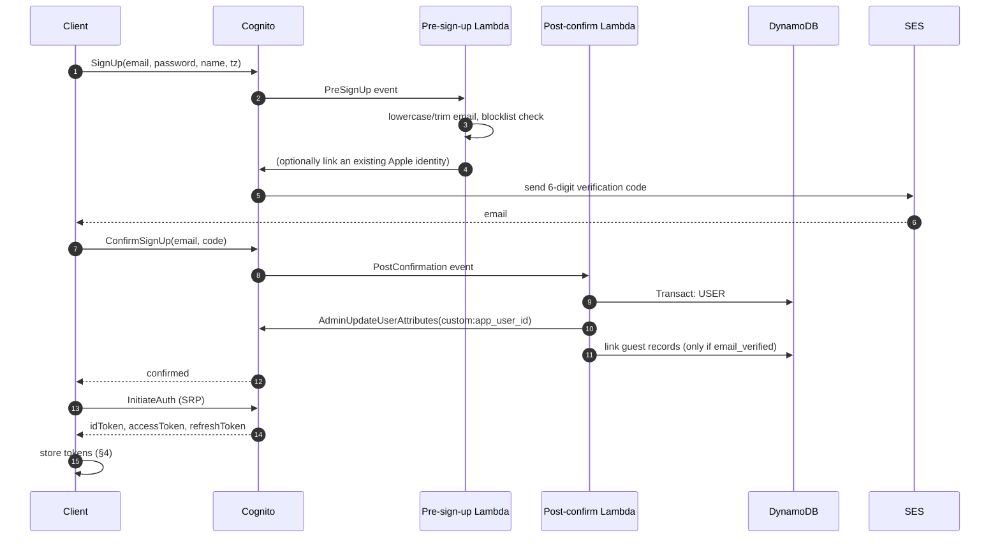
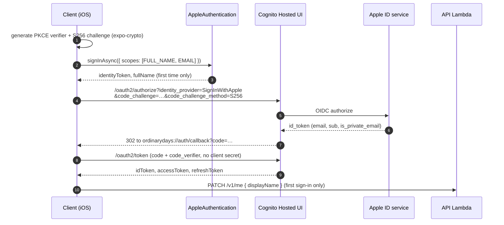
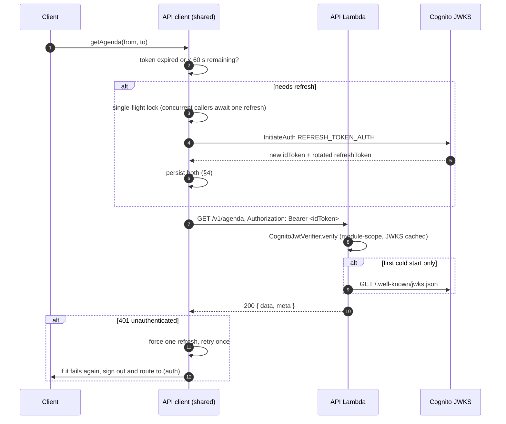

# Authentication and authorisation

**Status:** canonical for identity. The wire contract for authorisation *rules* (who may
do what to an activity) lives in `api-contract.md` §3 and is not restated here; this
document covers how a caller proves who they are.

Provider: **Amazon Cognito user pools**, one per environment. Sign-in methods:
email + password, and **Sign in with Apple**. Tokens are verified in the Lambda with
`aws-jwt-verify`. All of it is defined in `infra/lib/stacks/auth-stack.ts`.

---

## 1. User pool configuration

One pool per environment: `od-users-dev`, `od-users-prod`. Users are **not** shared
between them — a dev account is a different account from a prod account, deliberately.

### 1.1 Attributes

| Attribute | Type | Required | Mutable | Notes |
| --- | --- | --- | --- | --- |
| `email` | string | Yes | Yes | The identity anchor. Must be verified. |
| `name` | string | No | Yes | Display name. Populated from Apple's `fullName` on first sign-in when the user grants it, otherwise collected in onboarding. |
| `custom:app_user_id` | string (1–32) | No | **No** | The `usr_<ulid>` primary key in DynamoDB. Written once by the post-confirmation trigger. |
| `custom:tz` | string (1–64) | No | Yes | IANA timezone captured at sign-up. A convenience mirror; `USER#/PROFILE` is authoritative. |

Standard attributes we deliberately do **not** collect: `phone_number`, `address`,
`birthdate`, `gender`, `picture`. Every one of them would have to appear on an App Store
privacy label (`security-privacy.md` §8) and none of them serve a v1 feature.

`custom:app_user_id` is immutable because it is the tenant key. A mutable tenant key is an
account-takeover primitive.

```ts
// infra/lib/stacks/auth-stack.ts
const pool = new cognito.UserPool(this, 'Pool', {
  userPoolName: `od-users-${cfg.stage}`,
  selfSignUpEnabled: true,
  signInAliases: { email: true, username: false, phone: false },
  signInCaseSensitive: false,
  autoVerify: { email: true },
  keepOriginal: { email: true },
  standardAttributes: {
    email: { required: true, mutable: true },
    fullname: { required: false, mutable: true },
  },
  customAttributes: {
    app_user_id: new cognito.StringAttribute({ minLen: 1, maxLen: 32, mutable: false }),
    tz: new cognito.StringAttribute({ minLen: 1, maxLen: 64, mutable: true }),
  },
  // …password policy, MFA, recovery, triggers below…
  removalPolicy: cfg.stage === 'prod' ? RemovalPolicy.RETAIN : RemovalPolicy.DESTROY,
  deletionProtection: cfg.stage === 'prod',
});
```

`keepOriginal: { email: true }` matters: without it, changing an email address updates the
`email` claim before the new address is verified. With it, the old verified value is kept
in `email` until verification succeeds. That directly protects the guest-linking flow in
§8, which trusts `email` + `email_verified`.

### 1.2 Aliases and case

Sign-in alias is **email only**. There is no separate username: a username is one more
thing for a user to forget and one more identifier to keep unique.

`signInCaseSensitive: false` and the pre-sign-up trigger lowercases and trims the address
before it is stored, so `Alice@Example.com` and `alice@example.com` are the same account.
The `EMAIL#<lowercased-email>` lookup partition in `data-model.md` §3.4 assumes this
normalisation; if it were not enforced at the pool, guest linking would silently miss.

Plus-addressing (`alice+plans@example.com`) is **not** normalised away. It is a legitimate
distinct address and stripping it would let one person's `alice+x@` sign-up collide with
another's mailbox rules.

### 1.3 Password policy

| Setting | Value | Reasoning |
| --- | --- | --- |
| Minimum length | 12 | Length is the only password rule with strong evidence behind it. |
| Require lowercase | Yes | Cognito's composition rules are cheap; keep the ones that do not push users to `Password1!`. |
| Require uppercase | Yes | |
| Require digits | Yes | |
| Require symbols | **No** | Symbol requirements measurably push users toward predictable substitutions and password reuse. The 12-character minimum does more work. |
| Temporary password validity | 3 days | Only relevant to admin-created users, which we do not do. |

The client additionally checks the candidate password against a small local list of the
most common passwords before submitting, so the user gets an inline message rather than a
Cognito error. This is a UX affordance, not a security control — the server-side policy is
what is enforced.

### 1.4 MFA stance

> **Decision: MFA is `OPTIONAL` at the pool level, TOTP only, off by default, opt-in from
> settings. SMS MFA is disabled entirely.**

Reasoning: this is a personal life planner, not a bank. Mandatory MFA on a consumer
planning app with a solo founder's support capacity produces exactly one outcome —
locked-out users emailing for help. Optional TOTP costs nothing to leave enabled and gives
the security-conscious user (and the founder's own account) a real second factor.

SMS is disabled because it requires an SNS spend limit increase, costs real money per
message, is the weakest common second factor, and is a documented account-takeover vector
via SIM swap.

Setting the pool to `OPTIONAL` rather than `OFF` at launch is important: switching a pool
from `OFF` to `OPTIONAL` later is possible, but having it configured from day one means the
software MFA settings and the `AssociateSoftwareToken` flow are exercised from the start
rather than bolted on.

```ts
mfa: cognito.Mfa.OPTIONAL,
mfaSecondFactor: { sms: false, otp: true },
```

### 1.5 Account recovery

`AccountRecovery.EMAIL_ONLY`. Phone recovery is impossible because we do not collect phone
numbers, and admin-only recovery would put the founder in the password-reset loop.

The reset email is sent through SES (§1.8) from `no-reply@ordinarydays.app`. The code is
6 digits with Cognito's default validity **[verify current default at
<https://docs.aws.amazon.com/cognito/latest/developerguide/user-pool-settings-message-customizations.html>]**;
set it explicitly to 15 minutes rather than relying on the default.

A user who signed up with Apple and has no password gets a clear message on the reset
screen ("This account signs in with Apple") rather than a generic failure. Cognito will
otherwise report success for a password reset on a federated user and the user will retry
forever.

### 1.6 Token lifetimes

| Token | Lifetime | Why |
| --- | --- | --- |
| ID token | **60 minutes** | The bearer token the API accepts. Short enough that a leaked token is a bounded problem; long enough that refresh is not constant. |
| Access token | 60 minutes | Issued but not used by our API (see §6). |
| Refresh token — mobile | **90 days** | A phone app that logs you out monthly is an app you stop using. The device holds it in the Keychain. |
| Refresh token — web | **30 days** | Shorter, because browser storage is a weaker container even with the HttpOnly cookie strategy in §4. |
| Auth code (PKCE) | 5 minutes (Cognito fixed) | — |

**Refresh token rotation is enabled on both app clients**, with a 60-second retry grace
period so a mid-flight network retry does not invalidate a valid session. Rotation means
each refresh returns a new refresh token and invalidates the old one; a stolen refresh
token becomes detectable, because the legitimate client's next refresh fails and the
session is terminated. **[verify]** the exact property names for rotation on
`CfnUserPoolClient` in the CDK version in the lockfile — this feature is newer than the
`UserPoolClient` L2 construct's full coverage, and it may need an escape hatch:

```ts
const cfnClient = mobileClient.node.defaultChild as cognito.CfnUserPoolClient;
cfnClient.refreshTokenRotation = {
  feature: 'ENABLED',
  retryGracePeriodSeconds: 60,
};
```

### 1.7 App clients

Three clients: two public ones for real users, **neither with a client secret**, and one
non-public client used only by CI. A secret embedded in a shipped mobile app or a browser
bundle is not a secret; PKCE is the correct mechanism for a public client and needs none.

| | `od-mobile-{env}` | `od-web-{env}` | `od-ci-{env}` |
| --- | --- | --- | --- |
| Purpose | The iOS app | The web build | Smoke tests only. Never shipped to a user. |
| Client secret | None | None | None |
| Auth flows | `ALLOW_USER_SRP_AUTH`, `ALLOW_REFRESH_TOKEN_AUTH` | `ALLOW_USER_SRP_AUTH`, `ALLOW_REFRESH_TOKEN_AUTH` | `ALLOW_ADMIN_USER_PASSWORD_AUTH`, `ALLOW_REFRESH_TOKEN_AUTH` |
| `ALLOW_USER_PASSWORD_AUTH` | **Disabled** | **Disabled** | **Disabled** |
| `ALLOW_ADMIN_USER_PASSWORD_AUTH` | **Disabled** | **Disabled** | Enabled — this is the whole reason it exists |
| OAuth flows | Authorization code + PKCE | Authorization code + PKCE | **None** |
| OAuth scopes | `openid`, `email`, `profile` | `openid`, `email`, `profile` | — |
| Identity providers | Cognito, Apple | Cognito, Apple | Cognito only |
| Callback URLs | `ordinarydays://auth/callback`, `ordinarydays-dev://auth/callback`, `exp://…` (dev only) | `https://ordinarydays.app/auth/callback`, `http://localhost:8081/auth/callback` (dev only) | **None** |
| Logout URLs | `ordinarydays://auth/signout` | `https://ordinarydays.app/` | **None** |
| Refresh token validity | 90 days | 30 days | 1 day |
| Prevent user existence errors | Yes | Yes | Yes |
| Read attributes | `email`, `email_verified`, `name`, `custom:app_user_id`, `custom:tz` | same | same |
| Write attributes | `name`, `custom:tz` | same | same |

`ALLOW_USER_PASSWORD_AUTH` is disabled on purpose: it sends the plaintext password to
Cognito's API. SRP never transmits the password at all. The client SDK handles SRP; there
is no reason to accept the weaker flow.

`od-ci-{env}` exists because the authenticated smoke test (`scripts/smoke.mjs`, Phase 4
P4-16) mints an ID token for a dedicated test user with `AdminInitiateAuth`, which requires
`ALLOW_ADMIN_USER_PASSWORD_AUTH` — a flow that must not exist on either client a real user's
app talks to. Isolating it on a third client keeps that flow off the shipped clients. The CI
role's IAM policy grants `cognito-idp:AdminInitiateAuth` on this pool and this client only.
A CDK assertion test asserts neither public client declares either password flow, and a live
check asserts `AdminInitiateAuth` against `od-mobile-{env}` is rejected and against
`od-ci-{env}` succeeds. See `03-implementation/phase-04-deploy-and-identity.md` P4-09.

`preventUserExistenceErrors: true` makes Cognito return the same generic error for "wrong
password" and "no such user", which stops the sign-in form being used to enumerate who has
an account.

`custom:app_user_id` is in the **read** attribute list and not the write list — the client
must be able to see it, and must never be able to change it.

### 1.8 Email delivery

The pool's email configuration uses **SES**, not Cognito's default sender:

```ts
email: cognito.UserPoolEmail.withSES({
  fromEmail: `no-reply@${cfg.hostedZoneName}`,
  fromName: 'Ordinary Days',
  replyTo: `support@${cfg.hostedZoneName}`,
  sesRegion: 'us-east-1',
  sesVerifiedDomain: cfg.hostedZoneName,
}),
```

Cognito's built-in sender is capped at 50 emails per day and sends from an
`amazonaws.com` address that lands in spam. Verification emails landing in spam is a
sign-up funnel that silently does not work.

### 1.9 Lambda triggers

Two, both small, both in `services/api/src/triggers/`.

**Pre-sign-up (`od-cognito-presignup-{env}`)**

1. Lowercase and trim `event.request.userAttributes.email`; write it back.
2. Reject addresses on a small disposable-domain blocklist with a clear message.
3. If this is a federated sign-up (Apple) and a Cognito-native user already exists with the
   same **verified** email, link the identities with `AdminLinkProviderForUser` rather than
   creating a second account. Without this, signing up with email and later using "Sign in
   with Apple" produces two accounts for one person, which is the single most common
   Cognito complaint.
4. Never auto-confirm. `event.response.autoConfirmUser` stays `false`; the email
   verification step is what makes §8's guest linking safe.

**Post-confirmation (`od-cognito-postconfirm-{env}`)**

Runs once, after the email is verified. It is the only place a user profile is created.

1. Generate `userId = 'usr_' + ulid()`.
2. `TransactWriteItems`:
   - Put `USER#<userId> / PROFILE` with the defaults (timezone from `custom:tz` or
     `America/New_York`, currency `USD`, `weekStartsOn: 0`, reminder default absent/Off,
     onboarding state `new`), with
     `attribute_not_exists(pk)` so a retry cannot create a second profile.
   - Put `EMAIL#<lowercased-email> / USER` pointing at `userId`, also with
     `attribute_not_exists(pk)`.
3. `AdminUpdateUserAttributes` to write `custom:app_user_id = userId` back onto the
   Cognito user. From this point every ID token carries the tenant key.
4. Kick off guest linking (§8) — but only if `event.request.userAttributes.email_verified`
   is `'true'`.
5. Any failure throws. A post-confirmation failure means Cognito reports sign-up as failed,
   which is the correct outcome: a confirmed Cognito user with no DynamoDB profile is a
   broken account that will 500 on every request.

The trigger is idempotent by construction (the conditional puts). Cognito retries triggers,
and a non-idempotent post-confirmation handler produces duplicate profiles.

---

## 2. Sign in with Apple

### 2.1 Why it is mandatory

App Store Review Guideline 4.8 requires that an app offering **any** third-party or
social login must also offer an equivalent login option that limits data collection to
name and email and lets the user keep the email private. Sign in with Apple satisfies it
directly. Apps have been rejected for this repeatedly and it is caught at review, not at
submission, so discovering it late costs a full review cycle.

Ordinary Days offers Cognito email+password, which on its own would not trigger 4.8. But
the moment any social provider is added — and Google sign-in is an obvious future request —
Apple becomes required. It is cheaper to build it now, when the auth flow is being written
anyway, than to retrofit it into a shipped account model. It is also a genuinely better
sign-up experience on iOS: one Face ID prompt instead of a password and a verification
email.

### 2.2 Setup steps

Requires a paid Apple Developer Program membership ($99/yr, `cost-model.md` §3).

1. **App ID.** developer.apple.com → Certificates, Identifiers & Profiles → Identifiers →
   register `app.ordinarydays.ios`. Enable the **Sign In with Apple** capability.
2. **Services ID.** Register a second identifier of type *Services ID*, e.g.
   `app.ordinarydays.signin`. This is what Cognito uses as its `client_id` for the web/OIDC
   leg. Enable Sign In with Apple on it and configure:
   - Primary App ID: `app.ordinarydays.ios`
   - Domains: `ordinarydays.app`, and the Cognito domain
     `od-{env}.auth.us-east-1.amazoncognito.com`
   - Return URLs:
     `https://od-{env}.auth.us-east-1.amazoncognito.com/oauth2/idpresponse`
   Both dev and prod Cognito domains must be listed, or dev sign-in fails with a redirect
   mismatch that Apple reports unhelpfully.
3. **Key.** Keys → new key → enable Sign In with Apple → associate the primary App ID →
   download the `.p8`. **It is downloadable exactly once.** Record the Key ID and the Team
   ID.
4. **Store the credentials.** Never in the repo:
   ```bash
   aws ssm put-parameter --type SecureString --name /od/prod/auth/apple/team-id \
     --value 'ABCDE12345'
   aws ssm put-parameter --type SecureString --name /od/prod/auth/apple/key-id \
     --value 'FGHIJ67890'
   aws ssm put-parameter --type SecureString --name /od/prod/auth/apple/private-key \
     --value "$(cat AuthKey_FGHIJ67890.p8)"
   rm AuthKey_FGHIJ67890.p8
   ```
5. **Cognito identity provider.** `UserPoolIdentityProviderApple` in `AuthStack`, reading
   those parameters, with attribute mapping `email → email`, `name → name`, and scopes
   `email name`.
6. **Client.** `expo-apple-authentication` on iOS gives the native sheet;
   `expo-auth-session` drives the Cognito Hosted UI leg on web. Add
   `expo-apple-authentication` to the plugins array in `app.config.ts` so prebuild adds the
   entitlement.
7. **Verify before submission.** Test on a real device with a real Apple ID, including the
   *Hide My Email* path, which returns an `@privaterelay.appleid.com` address.

### 2.3 The private relay address

A user who chooses "Hide My Email" gives us a relay address. Consequences that must be
handled, not discovered:

- It is a real, deliverable address — SES mail reaches them, as long as the sending domain
  is registered with Apple's private email relay service (Certificates, Identifiers &
  Profiles → More → Configure). **Do this during setup**, or invite emails to relay
  addresses bounce.
- It is stable per (user, app) pair, so it works as an identity key.
- It will almost never match a guest record's email, so §8's linking will not fire for
  these users. That is correct behaviour, not a bug — the app must offer the manual
  "these are the same person" merge path (`POST /v1/people/:id/merge`) as the fallback.

### 2.4 Apple's name quirk

Apple returns the user's full name **only on the very first authorisation**, never again.
If it is dropped on first sign-in there is no way to retrieve it short of the user
revoking the app in iOS Settings and starting over. The client must capture
`credential.fullName` on that first response and send it to `PATCH /v1/me`. Onboarding
falls back to asking for a display name when it is absent.

---

## 3. Sequences

### 3.1 Sign-up (email + password)



### 3.2 Sign-in with Apple



### 3.3 Authenticated request and refresh



The **single-flight lock** on refresh is not optional. Without it, an app resuming from
background fires six queries at once, all see an expired token, all call
`REFRESH_TOKEN_AUTH` with the same refresh token, and with rotation enabled five of them
get an invalid-token error and the user is signed out. One promise, shared by every caller.

Likewise, a `401` triggers **at most one** retry. An unconditional retry loop against an
expired session is how a client generates thousands of requests per minute.

### 3.4 Sign-out

1. Client calls `GlobalSignOut` (or the Hosted UI `/logout` endpoint on web) so the
   refresh token is invalidated server-side. A local-only sign-out leaves a live refresh
   token on the device.
2. `DELETE /v1/me/devices/:deviceId` to unregister the Expo push token, so the device stops
   receiving this account's notifications. Skipping this is how a shared or resold device
   leaks a stranger's reminders.
3. Clear the token store (Keychain entries on iOS; in-memory token and the refresh cookie
   on web, the latter via `POST /public/v1/auth/logout` which clears it with `Max-Age=0`).
4. `apiClient.clearCache()` — remove the in-memory ETag/body pairs added in Phase 2. Their
   keys are identity-scoped, but explicit clearing is still part of ending the session;
   replacing a client instance is not an auth boundary.
5. `queryClient.clear()` — remove every cached server response, including the persisted
   cache on disk. TanStack Query's persister must be purged explicitly; clearing the store
   in memory is not enough.
6. **The durable intent log is quarantined, not cleared** (Phase 2.6). Unacknowledged
   offline writes are user data — destroying them at sign-out would silently lose work, and
   an offline sign-out is exactly when unsynced writes exist. The log is namespaced by
   immutable `userId` and every intent stores its `ownerUserId`; after sign-out it is
   neither hydrated nor replayed until the **same** account signs back in. A different
   account signing in on the device sees nothing from it and can trigger nothing in it —
   replay under a different authenticated principal would create entities the server owns to
   the wrong person. Account deletion purges the quarantined log
   (`security-privacy.md` §3).
7. Route to `(auth)/sign-in`.

Steps 3 through 5 run even if step 1 fails (offline sign-out must work). Step 1 is retried
opportunistically on next launch.

---

## 4. Token storage

### 4.1 iOS

`expo-secure-store`, which wraps the iOS Keychain.

```ts
// src/lib/storage.ios.ts
import * as SecureStore from 'expo-secure-store';

const OPTS = {
  keychainAccessible: SecureStore.WHEN_UNLOCKED_THIS_DEVICE_ONLY,
} as const;

export const tokenStore = {
  get: (k: string) => SecureStore.getItemAsync(k, OPTS),
  set: (k: string, v: string) => SecureStore.setItemAsync(k, v, OPTS),
  del: (k: string) => SecureStore.deleteItemAsync(k, OPTS),
};
```

`WHEN_UNLOCKED_THIS_DEVICE_ONLY` means the item is unreadable while the device is locked
and is **excluded from iCloud Keychain and from encrypted backups**. A refresh token that
syncs to iCloud is a refresh token that exists on every device the user owns and in every
backup, which is not what a session credential should be.

`AsyncStorage` is never used for tokens. It is an unencrypted file in the app container.

The ID token is also held in memory for the lifetime of the process so the common path
does not hit the Keychain on every request.

### 4.2 Web

> **Decision: on web, the ID token is held in JavaScript memory only, and the refresh
> token is held in an `HttpOnly; Secure; SameSite=Lax` cookie scoped to
> `.ordinarydays.app`, set by our own API. The client never sees the refresh token.**

This requires three new unauthenticated endpoints, which must be added to
`api-contract.md` §2.10 in the same pull request that implements this:

| Method | Path | Purpose |
| --- | --- | --- |
| `POST` | `/public/v1/auth/token` | Exchange a PKCE `code` + `code_verifier` for tokens. Returns the ID token in the body; sets the refresh token as an `HttpOnly` cookie. |
| `POST` | `/public/v1/auth/refresh` | Reads the cookie, calls Cognito `REFRESH_TOKEN_AUTH`, returns a new ID token, rotates the cookie. |
| `POST` | `/public/v1/auth/logout` | Calls `GlobalSignOut` and clears the cookie with `Max-Age=0`. |

All three require a double-submit CSRF token (a non-`HttpOnly` cookie whose value must be
echoed in an `X-CSRF-Token` header), because `SameSite=Lax` alone does not protect a
`POST` from a top-level cross-site navigation in every browser.

**The XSS trade-off, stated plainly.**

| Storage | XSS can steal the access/ID token | XSS can steal the refresh token | XSS can act as the user |
| --- | --- | --- | --- |
| `localStorage` (both tokens) | Yes | **Yes** | Yes, and **persistently, from the attacker's own machine, for 30 days** |
| In-memory ID token + `HttpOnly` refresh cookie | Yes | No | Yes, but **only from within the compromised page, only until it is closed** |

Neither option survives XSS. Anyone claiming an `HttpOnly` cookie "prevents XSS token
theft" is overstating it — a script running in the page can simply make authenticated
requests through the cookie. What the cookie buys is that the **long-lived** credential
never leaves the browser, so the compromise is bounded by the tab's lifetime instead of by
the refresh token's 30-day validity. That is a meaningful reduction in blast radius, and
it is the difference between "an attacker did something while the user was on the page"
and "an attacker has had a working session for a month".

The cost is real and is accepted: three extra endpoints, CSRF handling, and a login flow
that differs between platforms. The mitigations that actually prevent the XSS in the first
place matter more than the storage choice, and are in `security-privacy.md` §4 — a strict
Content Security Policy on the CloudFront response headers policy, no `dangerouslySetInnerHTML`,
no `eval`, and React Native Web's `Text` primitive escaping everything by default.

`sessionStorage` was rejected: it survives XSS no better than `localStorage` and it loses
the session on every new tab, which on web is a constant annoyance.

Cookies are scoped to `.ordinarydays.app` so `ordinarydays.app` (web) and
`api.ordinarydays.app` (API) share them. The API's CORS configuration therefore sets
`credentials: true` and an explicit origin allow-list — never `*`, which the browser
rejects in combination with credentials anyway.

---

## 5. Server-side verification

### 5.1 The verifier

This is the body of `CognitoIdentityProvider`, which implements the `IdentityProvider`
interface declared in `services/api/src/middleware/identity.ts` and is selected there by
`AUTH_MODE=cognito`
(`phase-01-activity-core.md` P1-01, `phase-04-deploy-and-identity.md` P4-17). The verifier
construction, the JWKS hydration and the claim checks below are unchanged by the seam; what
the seam changes is that the resolved value reaches handlers as `c.get('userId')` and no
handler, service or repository knows a token was involved.

```ts
// services/api/src/middleware/cognito-identity.ts
import { CognitoJwtVerifier } from 'aws-jwt-verify';
import type { Context } from 'hono';
import type { UserId } from '@od/shared/types';
import type { IdentityProvider } from './identity';

// Module scope. Created once per execution environment, reused by every warm invocation.
const verifier = CognitoJwtVerifier.create({
  userPoolId: config.COGNITO_USER_POOL_ID,
  tokenUse: 'id',
  // Three entries, not two: the CI client's tokens must verify too (§1.7).
  clientId: [
    config.COGNITO_MOBILE_CLIENT_ID,
    config.COGNITO_WEB_CLIENT_ID,
    config.COGNITO_CI_CLIENT_ID,
  ],
});

// Warm the JWKS cache during init, not on the first request.
const hydrated = verifier.hydrate().catch((e) => {
  logger.warn({ err: e }, 'jwks hydrate failed; will fetch on first verify');
});

export class CognitoIdentityProvider implements IdentityProvider {
  async resolve(c: Context): Promise<UserId> {
    const header = c.req.header('Authorization');
    if (!header?.startsWith('Bearer ')) {
      throw new AppError('unauthenticated', 'Missing bearer token.');
    }
    await hydrated;

    let claims: CognitoIdTokenPayload;
    try {
      claims = await verifier.verify(header.slice(7));
    } catch (err) {
      logger.warn({ err: (err as Error).name }, 'jwt verification failed');
      throw new AppError('unauthenticated', 'Invalid or expired token.');
    }

    const userId = claims['custom:app_user_id'];
    if (typeof userId !== 'string' || !userId.startsWith('usr_')) {
      // Confirmed in Cognito but the post-confirmation trigger did not complete.
      throw new AppError('unauthenticated', 'Account setup incomplete.');
    }
    return userId as UserId;
  }
}

// The middleware is the one in P1-01 and is not re-declared here:
// c.set('userId', await identityProvider.resolve(c)).
```

The provider returns the ID and nothing else. `email`, `email_verified` and `sub` are read
from the verified claims at the two places that need them — guest-to-account linking and log
correlation — rather than being carried on the context, so no handler acquires a dependency
on a token having been present.

### 5.2 The caching pattern

Three levels, all necessary:

1. **JWKS cached in module scope.** `aws-jwt-verify` fetches the pool's public keys once
   and holds them. On a warm invocation, verification is pure local RSA — no network call,
   sub-millisecond. Creating the verifier *inside* the handler would fetch the JWKS on
   every request and add 50–200 ms to every single API call. This is the most common
   Cognito performance mistake.
2. **`hydrate()` during init.** Moves the one JWKS fetch into the Lambda init phase, which
   is billed differently and happens before the first request's clock starts.
3. **No token cache.** We do **not** cache verification results by token string.
   Verification of a cached JWKS is already microseconds; a result cache would only add a
   window in which a revoked session still works.

Key rotation is handled by the library: an unknown `kid` triggers a single JWKS refetch,
rate-limited internally so a stream of bogus `kid`s cannot be used to hammer Cognito.

### 5.3 What is verified, and which claims are trusted

`aws-jwt-verify` checks, and we rely on all of it:

| Check | Value |
| --- | --- |
| Signature | Against the pool's JWKS (RS256) |
| `iss` | `https://cognito-idp.us-east-1.amazonaws.com/<poolId>` |
| `aud` | One of our two app client IDs |
| `token_use` | `id` |
| `exp` / `nbf` | Not expired, not future-dated |

**Trusted claims** — used for authorisation decisions:

| Claim | Used for |
| --- | --- |
| `custom:app_user_id` | **The tenant key.** Every DynamoDB key derived from the caller uses this and only this. |
| `sub` | Correlation and logging only |
| `email` + `email_verified` | Guest linking (§8) and only when `email_verified === true` |
| `exp` | Implicit, via the verifier |

**Not trusted:**

- Any user ID, owner ID, or person ID in a request path, query string, or body. Ownership
  is established by reading `ACT#<id>/META` and comparing `ownerId` to the token's
  `custom:app_user_id` (`api-contract.md` §3). "Never trust an ID in the path" is the rule
  that prevents IDOR.
- `name` / `custom:tz`. They are user-writable through Cognito and are only ever display
  hints; the authoritative values are in `USER#/PROFILE`.
- `cognito:groups`. We do not use groups. If admin functionality ever appears, it gets an
  explicit attribute in the profile item, checked server-side — not a JWT claim the user's
  own pool operations could touch.

> **Decision: the API accepts the *ID* token, not the access token.** This is unusual
> enough to write down. Cognito's access token does not carry `email` or custom attributes
> unless a pre-token-generation trigger adds them, and we need `custom:app_user_id` on
> every request. The ID token carries it natively. Both are signed by the same pool and
> verified identically; the practical difference is claim content. The `aud`/`token_use`
> checks above make it impossible to substitute one for the other. This matches
> `api-contract.md`'s "Bearer &lt;Cognito ID token&gt;".

---

## 6. The unauthenticated invite surface

The public invite page (concept §15) is the only part of the system a stranger can reach.
It is isolated by five separate mechanisms, and all five are required.

**1. Path prefix, decided in one place.** Only `/public/v1/*` skips the auth middleware,
and that decision is made in a single `routeSplit` middleware
(`tech-stack.md` §4.2), not by a per-route `skipAuth` flag that someone can copy onto the
wrong route.

```ts
app.use('*', requestId, logger, cors, securityHeaders, bodyLimit);
app.route('/public/v1', publicRoutes);        // rate-limited by IP, no auth
app.use('/v1/*', auth, rateLimit, idempotency);
app.route('/v1', privateRoutes);
app.all('*', () => { throw new AppError('not_found', 'No such route.'); });
```

**2. Unguessable tokens.** 22 characters of base62 from `crypto.randomBytes(16)` —
128 bits (`data-model.md` §4.9). Deliberately **not** a ULID: a ULID leaks its creation
timestamp and is sequential, so knowing one would let you guess neighbours. The token is
looked up with a direct `GetItem` on `INVITE#<token>`, so a wrong token costs one failed
read and reveals nothing.

**3. A separate, minimal projection.** The public handler never returns an `Activity`. It
builds a `PublicInvite` DTO explicitly, field by field, from a dedicated repository method.
Per `api-contract.md` §2.10 it contains only title, date/time, location, description,
poster image, organiser display name, and RSVP counts. Never expenses, never notes, never
other participants' emails, never any other activity. The rule enforced in review:
**the public route must not import any service used by the authenticated routes.** A
shared "get activity" service will eventually leak a field somebody added for the authed
screen.

**4. IP rate limiting.** 30 requests/minute per IP (`api-contract.md` §4), keyed on a
SHA-256 hash of the `X-Forwarded-For` client IP so raw addresses are never written to
DynamoDB or logs. RSVP submission additionally limits per token: 10 attempts per hour, so
a single invite cannot be spammed.

**5. Expiry and revocation.** Tokens expire 90 days after the plan's date and return `410
invite_expired`; a revoked token returns `410 invite_revoked`. The DynamoDB `ttl` is set to
expiry + 30 days so the record is still present to give the specific error rather than a
bare `404`, and then disappears.

An RSVP through the public surface may only set that invite's own `Participant` row's
`rsvp` field. It cannot create, edit, or delete anything else. Guests get no
`ActivityIndex` entry (`data-model.md` §3.5) and therefore have no feed, no Today, and no
way to enumerate anything.

---

## 7. Guest to account linking

The product requirement is concept §24: a guest who later registers with the same verified
identity should have their existing Plans, pending shared Lists, People relationships and
expenses connected to the new account rather than duplicated.

### 7.1 The security requirement

> **No guest record is ever merged into an account until Cognito reports
> `email_verified === true` for that address.**

Without this, the attack is trivial: sign up as `victim@example.com`, do not verify, and
inherit every plan and expense anyone ever invited that address to — including expense
amounts, participant names, and plan locations. Email verification is the *only* thing
proving the registrant controls the address, so linking runs in the **post-confirmation**
trigger and nowhere else. There is no code path that links on sign-up.

Additional constraints:

- Matching is on the **exact lowercased address**. No fuzzy matching, no name matching, no
  domain matching. A name collision must never link two people.
- Apple private-relay addresses will not match a guest record's real address, by design.
  These users use the manual merge path (`POST /v1/people/:id/merge`), which requires the
  **owner** of the contact to confirm — the owner is the person who knows whether the two
  are the same human.
- Linking is idempotent and additive. It sets pointers; it never deletes a guest's history.

### 7.2 The flow

```mermaid
sequenceDiagram
    autonumber
    participant G as Guest (no account)
    participant OWN as Plan or List owner
    participant API as API
    participant DDB as DynamoDB
    participant COG as Cognito
    participant POST as Post-confirm Lambda

    OWN->>API: POST /v1/activities/:id/participants { displayName, email }
    API->>DDB: Transact: ACT#/PART# (isGuest=true), USER#owner/PERSON#,<br/>USER#owner/PLINK#, INVITE#token/META
    API-->>OWN: inviteUrl
    OWN-->>G: share link (or SES invite email)
    G->>API: GET /public/v1/invites/:token
    G->>API: POST /public/v1/invites/:token/rsvp { going }
    API->>DDB: update ACT#/PART#.rsvp only

    Note over G: later, the guest installs the app
    G->>COG: SignUp(email = the same address)
    COG->>COG: send verification code
    G->>COG: ConfirmSignUp(code)
    Note over COG: email_verified becomes true
    COG->>POST: PostConfirmation
    POST->>DDB: create USER#/PROFILE + EMAIL#/USER
    POST->>POST: guard: email_verified === true, else stop
    POST->>DDB: Query GUESTEMAIL#verified-address for owner/person refs
    loop each matched Person, each of its activities
        POST->>DDB: set person.linkedUserId = newUserId
        POST->>DDB: set ACT#/PART#.userId = newUserId, isGuest = false
        POST->>DDB: put USER#newUserId/IDX#activityId (GSI1, so it appears on their Today)
        POST->>DDB: put USER#newUserId/PLINK#ownerPersonId
    end
    loop each invited LLINK#personId# row
        POST->>DDB: activate LIST#/MEMBER# and set reciprocalPersonId
        POST->>DDB: put USER#newUserId/LIST# + reciprocal PERSON#
        POST->>DDB: activate owner LLINK# + put member LLINK#
    end
    POST-->>G: sign-up completes; Plans, Lists and People are already there
```

### 7.3 Implementation notes

- **Bounded work.** The trigger has a 5-second Cognito timeout. It links at most the first
  50 matched activities and first 20 invited List memberships inline; if there are more, it writes a
  `USER#<u> / LINKJOB#<ulid>` item and a follow-up runs asynchronously. A trigger that
  times out fails the user's sign-up, which is far worse than a delayed link.
- **Discovery.** Guest `Person` records are stored under their *owner's* partition
  (`USER#<owner> / PERSON#<personId>`), so there is no global index of guest emails and no
  `Scan` is permitted. A `GUESTEMAIL#<lowercased-email>` lookup partition is written at the
  time a guest with an email is added, listing `{ ownerId, personId }` pairs. It is
  recorded in `data-model.md` §3.4 with the sort key `OWNER#<ownerId>#PERSON#<personId>`,
  and as access pattern 14b. Without it, linking cannot be done without a table scan.
- **List discovery.** Each `{ ownerId, personId }` pair then queries that owner's
  `LLINK#<personId>#` prefix. Invited rows identify exact `ListMember` keys; activation writes
  the recipient's List pointer, creates/reuses the reciprocal owner Person, activates the
  owner link and writes the member link. `LLINK#` itself never grants List access.
- **Balances.** Existing `Balance` and `Expense` rows reference `personId`, not `userId`,
  and stay as they are. The new user sees the balance through the linked `Person`. Nothing
  is recomputed, so no money can change during a link.
- **Not automatic in reverse.** Registering does **not** give the new user any ability to
  see the owner's other data, or to edit the plans they were added to beyond a
  participant's rights (`api-contract.md` §3).
- **Audit.** Every link writes a structured log line with `userId`, `ownerId`, `personId`,
  optional `activityId`/`listId`, and the matched email **hashed**, never in plaintext
  (`security-privacy.md` §4).

---

## 8. Account deletion

App Store Guideline 5.1.1(v) requires that any app supporting account creation must also
let the user **initiate deletion of the account from within the app** — not a support
email, not a web form. This is enforced at review.

**Endpoint:** `DELETE /v1/me` (`api-contract.md` §2.1). Soft-delete now, hard purge after
30 days.

**In the app.** Settings → Account → Delete account. A confirmation screen that states
plainly what is deleted, what is retained and why, and that the account can be restored by
signing in within 30 days. Requires re-authentication (SRP, or an Apple re-authorisation)
immediately before the call — a session left open on an unlocked device must not be able to
delete the account.

The confirmation also names the financial consequence in plain language: `At final deletion,
expenses and settlements on plans you shared stay visible to the people you shared them
with, with your name shown as "Deleted user". Expenses on plans only you could see are
deleted.` This is the retain-and-anonymise rule (Decision below); it is delayed until the
irreversible purge, and restoration during the 30-day window changes nothing.

**Immediately on request:**

1. `USER#<u> / PROFILE` gets `deletedAt` and `purgeAfter` (now + 30 days), plus `ttl` set
   to the same instant.
2. `AdminDisableUser` in Cognito, then `AdminUserGlobalSignOut` — every token and every
   refresh token is invalidated at once.
3. All the user's `DEVICE#` rows are deleted, so push stops immediately.
4. All EventBridge schedules with the user's prefix are deleted, so no reminder fires for a
   deleted account.
5. Invites the user created are **not** revoked. Soft-delete disables the owner, not their
   plans: shared plans stay live for their participants, invite links keep resolving, and
   guests can still RSVP.
6. The auth middleware returns `401` for any token bearing a `custom:app_user_id` whose
   profile has `deletedAt` set — checked with the profile read the request needs anyway.

> **Decision — soft-delete is invisible to everyone but the owner (2026-08-07).**
> Participant-facing behaviour during the 30-day window is: **nothing changes.** No invite
> is revoked, no plan is cancelled, no email goes out, nothing is anonymised. A soft-delete
> that started tearing down shared state would make the 30-day restoration a lie — the
> cancellations would already have been sent and could not be unsent. Everything loud or
> destructive is deferred to the purge.

**Restoration.** Signing in within 30 days (the Cognito user still exists, disabled) routes
to a "restore your account?" screen. Confirming clears `deletedAt`, `purgeAfter`, and
`ttl`, and re-enables the Cognito user. Because nothing shared was revoked, cancelled or
rewritten during the window, restoration resumes everything unchanged — plans, invites,
memberships and balances are exactly as they were. After 30 days, restoration is impossible
and the UI says so.

**At purge (30 days).** A DynamoDB TTL deletion on the profile triggers a Streams handler,
or the daily maintenance Lambda sweeps `purgeAfter < now`. Either way:

Before deleting anything, the resumable purge job splits the deleting user's financial
footprint in two (Decision below). **Retained:** every Expense and Settlement audit row
whose coverage touches a shared plan with surviving participants — owned by the deleted
user or by someone else — is kept exactly as it stands, settled state intact, anonymised
(`Deleted user`, `linkedUserId` cleared); nothing on these rows is unwound, and the
balances they produce become read-only history. **Unwound-then-deleted:** Settlements whose
coverage concerns nobody but the deleted account (solo plans, or shared plans with no
surviving participant) get the ordinary exact whole-Settlement Undo — recorded
debtor/reverse-map pairs conditionally removed, Expense roll-ups recomputed, locator
deleted — before their Activities are removed, so a deleted row never leaves a dangling
reverse reference. A Settlement spanning both halves is treated as retained; coverage is
never silently shortened or its amount rewritten. Only after every checkpoint succeeds may
the job delete Activities or the user partition. Before that partition disappears, the same
checkpointed job walks its List pointers: it cascades each List the user owns and removes
the user from each List owned by someone else. A retry resumes from the checkpoint, so
there is never a retained Expense whose reverse map points at deleted Settlement history.

> **Decision — the purge cancels loudly and keeps the money legible (2026-08-07).** Extends
> the settlement ruling above (#37/M7). Two rules govern shared state at purge. (a) **Owned
> shared plans are cancelled with notification before removal.** The purge runs the
> ordinary cancellation for each — the `plan_cancelled` push to app users, the cancellation
> email to guests — and only then deletes, exactly the rule that binds a live owner
> deleting a shared plan (`01-product/sharing-and-people.md` §2.1: deleting a shared plan
> is never silent). (b) **Financial records survive, anonymised.** Expenses and Settlement
> audit rows on shared plans are retained for the surviving participants, with the deleted
> owner's display name replaced by `Deleted user`; balances involving the deleted account
> become read-only history — visible and drillable, never again settleable. Deleting an
> account must not make other people's arithmetic stop reconciling, and it must not make
> their history illegible either.

| Data | Action |
| --- | --- |
| Activities owned by the user, and everything in their `ACT#` partitions | Solo and never-shared ones are deleted. A shared one with surviving participants is first cancelled with notification, then its partition is **retained**, anonymised, as read-only history for the survivors — Expense rows, settlement coverage and audit references intact, owner disabled — per the Decision above and `data-model.md` §7 |
| Lists owned by the user | Deleted through the ordinary resumable List cascade: List partition, every member pointer, every invited/active owner/member `LLINK#`, and every viewer `LNK#`. Other users' owner-scoped `PERSON#` contacts remain. |
| Memberships on Lists owned by other users | Remove the deleting user's `MEMBER#`, pointer and both reciprocal `LLINK#` rows, decrement `memberCount`, and delete that viewer's `LNK#` rows. Items remain. The other owner's `PERSON#` contact remains with `linkedUserId` cleared. |
| The user's `USER#` partition: remaining index entries, people, links, balances, devices, and Settlement rows already unwound above | Deleted only after the cross-partition List cleanup checkpoints succeed |
| `EMAIL#<email> / USER` | Deleted, so the address can be reused for a fresh sign-up |
| S3 objects under `u/<userId>/` | Deleted (batch delete, then verified) |
| The Cognito user | `AdminDeleteUser` |
| **Participant rows on activities owned by other people** | **Retained**, converted to a guest-style record with the display name kept and `userId`, `email` removed. |
| **Expenses the user was part of on other owners' Activities** | **Retained**, with the person reference kept and settled state intact. Only Settlements concerning nobody but the purged account are unwound (see above), so no retained reverse reference dangles and nobody's settled history reopens. |
| CloudWatch logs mentioning the user | Expire naturally at 14/30 days; not searched and purged |

The retention of other people's activities is deliberate and must be stated in the privacy
policy: deleting your account cannot delete someone else's plan or silently rewrite a
shared expense split so that the arithmetic stops reconciling. What is removed is the
personal data — the email address and the link to an account. What remains is a name on a
plan or a Person in somebody else's address book, which is that person's record of their own
life. Membership itself is not retained: account deletion removes access to Lists owned by
other people but leaves their items untouched.

**Data export.** Offered alongside deletion (`security-privacy.md` §8): a JSON export of
everything in the user's partitions, generated on request; the export object remains
available for 24 hours and each request returns a fresh short-lived download link
(`api-contract.md` §2.1). Not legally mandatory in every jurisdiction we serve, but
it is cheap to build on top of the same partition walk the purge already needs, and it
removes the "I can't leave" objection.
