# AWS services

**Status:** canonical for which AWS services exist and how they are configured. Every
resource here is created by CDK (`infrastructure.md`), not by console clicking.

Region: **`us-east-1` for everything.** CloudFront certificates must live there, and
keeping one region removes an entire class of cross-region confusion. Latency for a
single-founder-plus-beta user base does not justify multi-region.

Free-tier facts below come from the verified list in the project brief. Where a figure is
not in that list it is marked **[verify]** with a link to the pricing page.

---

## 1. Service-by-service

### 1.1 Amazon Cognito (user pools)

**What it does here.** The identity provider. Holds user accounts, hashes passwords, runs
the hosted sign-in flow for Sign in with Apple, and issues the JWTs the API trusts. Full
configuration is in `auth.md`; this section covers only the AWS-service view.

**How it is configured.** One user pool per environment (`od-users-dev`, `od-users-prod`).
Email as the sign-in alias, email verification required, Apple as a federated identity
provider. Three app clients: mobile and web (public clients, PKCE, no secret) and
`od-ci-{env}`, a non-public client with `ADMIN_USER_PASSWORD_AUTH` used only by the smoke
test — see `auth.md` §1.7. Two Lambda triggers: pre-sign-up and post-confirmation. Advanced security features
are **off** — they are billed per MAU on top of the free tier and are aimed at credential-
stuffing detection we do not yet need.

**Free-tier bucket.** Always free — **10,000 monthly active users**, and this allowance
explicitly does not expire after 12 months.

**Cost beyond.** Per-MAU pricing above 10,000. At the scale in `cost-model.md` this is
$0 indefinitely.

**Alternative considered.** Auth0, Clerk, or Supabase Auth. All are better developer
experiences. All start charging at a few thousand MAU, all put the identity of the product
in a third party's hands, and all require a second vendor relationship, a second billing
account, and a second outage surface. Cognito is free at our scale, lives in the same CDK
app as everything else, and `aws-jwt-verify` makes server-side verification a ten-line
concern. See `decisions.md` ADR-006.

---

### 1.2 Amazon API Gateway (HTTP API)

**What it does here.** The public HTTPS front door for `api.ordinarydays.app`. Terminates
TLS, maps a custom domain, and forwards every request to the single API Lambda.

**How it is configured.**

- `HttpApi` (v2), **not** REST API (v1).
- One `$default` route with a Lambda proxy integration, payload format **2.0**. All
  routing happens inside Hono. Declaring 60 individual routes in API Gateway would
  duplicate `api-contract.md` in a second place that can silently disagree with it.
- No API Gateway authorizer. Authentication happens in the Lambda so that the public
  invite routes and the authenticated routes share one code path and one error envelope.
  A JWT authorizer would move part of the auth decision out of the repo.
- Custom domain `api.ordinarydays.app` / `api.dev.ordinarydays.app` with an ACM
  certificate, `Route53` A-record alias to the API Gateway regional endpoint.
- Throttling: default route burst 100, rate 50 rps — a hard ceiling well above expected
  traffic and well below anything that could produce a bill. Per-user limits are enforced
  in Lambda (`api-contract.md` §4).
- Access logging to a CloudWatch log group in JSON, 14-day retention.
- CORS is handled in Hono, not in API Gateway, so there is one CORS configuration.

**Free-tier bucket.** **12 months only** — 1M HTTP API calls/month.

**Cost beyond.** $1.00 per million requests. At 1,000 users the projection in
`cost-model.md` is well under $1/month.

**Alternative considered.** A Lambda Function URL, which is free and has no per-request
charge. Rejected because it does not support custom domains without putting CloudFront in
front of it, has weaker throttling controls, and its request/response format differs from
the API Gateway v2 payload the Hono adapter is built around. The $1/M is worth the
straightforward custom domain and throttle configuration. **Revisit at Phase 7** if API
Gateway ever becomes a meaningful line item — the migration is a CDK change plus a DNS
cutover, and Hono's adapter supports both.

---

### 1.3 AWS Lambda

**What it does here.** All server-side compute. Four functions:

| Function | Trigger | Purpose |
| --- | --- | --- |
| `od-api-{env}` | API Gateway `$default` | The whole API. Hono router. |
| `od-reminder-{env}` | EventBridge Scheduler (one-shot, per reminder) | Sends one push notification via Expo Push. |
| `od-cognito-presignup-{env}` | Cognito pre-sign-up | Normalises email, blocks duplicates. |
| `od-cognito-postconfirm-{env}` | Cognito post-confirmation | Creates the user profile, links guest records. |

A fifth, `od-maintenance-{env}` (EventBridge daily rule), arrives in **Phase 5** (task
P5-22) for the 30-day account-deletion purge, and picks up the archival sweep described in
`data-model.md` §3.5 in Phase 9 (P9-33).

**How it is configured.**

| Setting | API | Reminder | Cognito triggers |
| --- | --- | --- | --- |
| Runtime | `nodejs22.x` | `nodejs22.x` | `nodejs22.x` |
| Architecture | `arm64` | `arm64` | `arm64` |
| Memory | 1024 MB | 512 MB | 512 MB |
| Timeout | 15 s | 30 s | 5 s |
| Reserved concurrency | 20 (dev) / 50 (prod) | 5 | 5 |
| Log retention | 14 d (dev) / 30 d (prod) | same | same |
| Log format | JSON (`pino`) | JSON | JSON |
| Env vars | table name, bucket name, user pool id, client ids, `LOG_LEVEL`, `STAGE` | same | same |
| Tracing | off — see §1.14 | off | off |

Reserved concurrency is a **cost guardrail first and a correctness guard second**: it caps
the blast radius of a retry loop or a traffic spike. It also reserves capacity so a runaway
reminder Lambda cannot starve the API.

No VPC. The Lambdas talk only to DynamoDB, S3, SES, EventBridge, Secrets Manager, and the
public Expo Push endpoint, all reachable over the public AWS network. Putting them in a
VPC would require either a NAT gateway (~$32/month, the single largest surprise-bill risk
in serverless AWS) or a set of VPC endpoints, for no security gain at this architecture.

**Free-tier bucket.** Always free — 1M requests and 400,000 GB-seconds per month.

**Cost beyond.** $0.20/M requests plus GB-second charges. `cost-model.md` shows we do not
approach the free allowance until well past 1,000 users.

**Alternative considered.** Fargate or App Runner for a long-running Node process.
Rejected: both bill continuously whether or not anyone uses the app, which directly
contradicts the $0-at-personal-scale target. Cold starts are the price and are budgeted at
under 400 ms (`tech-stack.md` §4.5).

---

### 1.4 Amazon DynamoDB

**What it does here.** The only database. Single table, key design fully specified in
`data-model.md`.

**How it is configured.**

- Table `od-main-{env}`, billing mode `PAY_PER_REQUEST` (on-demand).
- Partition key `pk` (S), sort key `sk` (S).
- One GSI, `GSI1` (`gsi1pk`/`gsi1sk`), projection **`INCLUDE`** of the AgendaItem fields
  only — not `ALL`. The agenda query is the hottest read in the product and a narrower
  projection means fewer RCUs and less GSI storage.
- TTL attribute `ttl`, enabled. Used by invite tokens, idempotency records, and rate-limit
  counters.
- Point-in-time recovery: **on in prod**, off in dev.
- Streams: `NEW_AND_OLD_IMAGES`, enabled from Phase 7 for balance recalculation and
  notification fan-out.
- Deletion protection: on in prod. `RemovalPolicy.RETAIN` in prod,
  `RemovalPolicy.DESTROY` in dev.
- Contributor Insights: off (it costs per event).

**Free-tier bucket.** Always free — **25 GB of storage**. Note the important caveat from
the brief: the always-free 25 read/write capacity units apply to **provisioned mode only**
and therefore do **not** cover our on-demand request charges.

**Cost beyond.** On-demand request pricing, which at this scale is cents per month. The
projections are in `cost-model.md`. **[verify]** the current per-million on-demand
read/write rates at <https://aws.amazon.com/dynamodb/pricing/on-demand/> before quoting a
figure to anyone.

**Why on-demand rather than provisioned.** Provisioned mode with 25 RCU/WCU would be
genuinely free, but it requires capacity planning, throttles under any burst, and would
need auto-scaling configuration to avoid 400s during a normal usage spike. On-demand costs
single-digit cents at our volume and never throttles a real user. The 25 GB storage
allowance — the part that actually matters for a data-heavy app — applies either way.

**Alternative considered.** Postgres on RDS or Aurora Serverless v2. Rejected in
`decisions.md` ADR-002: RDS has no meaningful free tier after 12 months, Aurora Serverless
v2 has a minimum ACU floor that bills continuously, and both need a VPC, which drags in
the NAT gateway problem. The access patterns in `data-model.md` §5 are all key-based; none
of them need a join or an ad-hoc query.

---

### 1.5 Amazon S3

**What it does here.** Two buckets per environment.

| Bucket | Contents | Access |
| --- | --- | --- |
| `od-web-{env}` | The static Expo web export | Private; read only by CloudFront via OAC |
| `od-media-{env}` | User-uploaded images (`u/<userId>/<ulid>.<ext>`) | Private; written by presigned `PUT`, read only by CloudFront via OAC |

A third, `od-artifacts-{env}`, holds Lambda deployment bundles and source maps; CDK's
bootstrap bucket serves this purpose and we do not create our own.

**How it is configured.**

- Block Public Access: **all four settings on**, on every bucket. There is no scenario in
  this app where an S3 object should be world-readable directly.
- Bucket policy grants `s3:GetObject` to `cloudfront.amazonaws.com` conditioned on the
  distribution ARN (Origin Access Control). No OAI — that is the legacy mechanism.
- Encryption: SSE-S3 (`AES256`). SSE-KMS would add per-request KMS charges for no
  meaningful gain given the bucket is already private and single-tenant.
- Versioning: on for `od-web-{env}` (so a bad web deploy can be rolled back by
  re-uploading), off for `od-media-{env}` (versioning user uploads doubles storage for no
  product benefit).
- CORS on `od-media-{env}`: `PUT` allowed from the app origins only, so browser presigned
  uploads work from the web build.
- Lifecycle rules on `od-media-{env}`:
  - abort incomplete multipart uploads after 1 day,
  - transition objects to Intelligent-Tiering after 90 days,
  - expire objects under `tmp/` after 1 day (the staging prefix a presigned upload lands
    in before it is confirmed and linked to an activity).
- Presigned `PUT` URLs: 5-minute expiry, `Content-Type` and `Content-Length` both bound
  into the signature, 10 MB cap, image MIME types only (`api-contract.md` §2.6).

**Free-tier bucket.** **12 months only** — 5 GB Standard storage, 20,000 GET, 2,000 PUT.

**Cost beyond.** $0.023/GB-month for Standard. 5 GB of images is roughly $0.12/month after
the first year.

**Alternative considered.** Cloudflare R2 (no egress charges) or storing small images as
base64 in DynamoDB. R2 is another vendor and another set of credentials. Base64 in
DynamoDB blows past the 400 KB item limit for anything but a thumbnail and makes every
activity read carry image bytes. S3 + CloudFront is the boring correct answer.

---

### 1.6 Amazon CloudFront

**What it does here.** Two distributions per environment.

| Distribution | Origin | Serves |
| --- | --- | --- |
| `od-web-{env}` | `od-web-{env}` S3 bucket (OAC) | `ordinarydays.app` / `dev.ordinarydays.app` — the static web app, including the public invite page |
| `od-media-{env}` | `od-media-{env}` S3 bucket (OAC) | `media.ordinarydays.app` — user images |

**How it is configured.**

- Price class `PRICE_CLASS_100` (North America + Europe). Cheaper, and our users are not
  yet elsewhere. Change when they are.
- HTTP/2 and HTTP/3 on, `viewerProtocolPolicy: REDIRECT_TO_HTTPS`, TLS 1.2 minimum.
- ACM certificate in `us-east-1` (mandatory for CloudFront).
- Web distribution:
  - Default root object `index.html`.
  - Cache policy: hashed asset paths (`/_expo/static/*`) get a one-year `max-age` and
    `immutable`; `*.html` gets `max-age=0, must-revalidate` so a deploy is visible
    immediately.
  - A **CloudFront Function** (viewer-request) rewrites extensionless paths to
    `path/index.html` so Expo Router's static export resolves. Dynamic segments
    (`/invite/<token>`) fall back to the route's pre-rendered shell, which then fetches
    `/public/v1/invites/:token` client-side.
  - Response headers policy adds HSTS, `X-Content-Type-Options`, `Referrer-Policy`, a
    `Permissions-Policy` denying camera/microphone/geolocation, and the Content Security
    Policy from `security-privacy.md` §4.
- Media distribution:
  - Long cache TTL (objects are immutable — the key contains a ULID).
  - No signed URLs in v1. Object keys contain a ULID under a per-user prefix, so they are
    unguessable, and the API only ever returns keys for images the caller may see. Signed
    URLs (or signed cookies) are the Phase 7 hardening step if media ever becomes
    sensitive enough to warrant the key management. Recorded as an open question in
    `decisions.md`.

> **Decision:** CloudFront Functions rather than Lambda@Edge for the URI rewrite.
> Functions run at the edge in sub-millisecond time, cost a tenth as much, and are free up
> to 2M invocations/month **[verify]** at
> <https://aws.amazon.com/cloudfront/pricing/>. Lambda@Edge is overkill for a string
> rewrite and adds replication delay to every deploy.

**Free-tier bucket.** Always free — 1 TB egress and 10M requests per month.

**Cost beyond.** Per-GB egress by region. 1 TB/month is an enormous allowance for a static
app; `cost-model.md` §5 covers the scenario where it is exceeded.

**Alternative considered.** S3 static website hosting directly (no CloudFront). Rejected:
it requires a public bucket, offers no HTTPS on a custom domain, no HTTP/2, and no cache
headers control. CloudFront is free here and strictly better.

---

### 1.7 Amazon Route 53

**What it does here.** Authoritative DNS for `ordinarydays.app`, and the domain registrar
(see `infrastructure.md` §3 for the registration runbook).

**How it is configured.** One public hosted zone. Records:

| Record | Type | Points to |
| --- | --- | --- |
| `ordinarydays.app` | A / AAAA alias | Web CloudFront distribution |
| `www.ordinarydays.app` | A alias | Same distribution (redirect handled by a CloudFront Function) |
| `media.ordinarydays.app` | A alias | Media CloudFront distribution |
| `api.ordinarydays.app` | A alias | API Gateway regional custom domain |
| `dev.ordinarydays.app`, `media.dev…`, `api.dev…` | A alias | Dev equivalents |
| `_dmarc`, `od._domainkey`, SPF `TXT`, SES CNAMEs | TXT / CNAME | SES domain identity + DKIM |
| ACM validation `CNAME`s | CNAME | Created automatically by CDK's `DnsValidatedCertificate` path |

**Free-tier bucket.** **None.** Route 53 has no free tier. A hosted zone is
**$0.50/month** flat, plus per-query charges (the first 1 billion standard queries are
$0.40/million) **[verify]** at <https://aws.amazon.com/route53/pricing/>. Alias records
pointing at CloudFront and API Gateway are **not** charged for queries.

**Cost beyond.** Effectively $0.50/month for the zone, plus domain registration (~$12–15/yr
for `.app`, which is on the HSTS preload list and therefore always HTTPS).

**Alternative considered.** Cloudflare DNS (free) with the domain registered at cost.
Genuinely cheaper by $6/year. Rejected because CDK can create and validate ACM certificates
against a Route 53 zone automatically; with external DNS, certificate validation becomes a
manual step on every new environment. $6/year is not worth a manual step in a deploy
pipeline run by an agent.

---

### 1.8 AWS Certificate Manager (ACM)

**What it does here.** TLS certificates for every custom domain.

**How it is configured.** Two certificates:

| Certificate | Region | Covers | Used by |
| --- | --- | --- | --- |
| Edge cert | **`us-east-1`** | `ordinarydays.app`, `*.ordinarydays.app` | CloudFront (both distributions) |
| Regional cert | `us-east-1` | `api.ordinarydays.app`, `api.dev.ordinarydays.app` | API Gateway custom domain |

Because everything is in `us-east-1`, these could be one certificate. They are kept
separate so that a future region move for the API does not force a CloudFront certificate
change. DNS validation, automated by CDK against the Route 53 zone. Auto-renewal is
automatic as long as the validation records stay in place — do not delete them.

**Free-tier bucket.** Public certificates are **free, always**, with no expiry on the
allowance. (ACM Private CA is not free and is not used.)

**Cost beyond.** None.

**Alternative considered.** Let's Encrypt via certbot. Free too, but requires a renewal
process we would have to run and monitor. ACM renews itself.

---

### 1.9 Amazon EventBridge Scheduler

**What it does here.** Fires reminders. When a user sets a reminder on an activity, the API
creates a **one-shot schedule** at the computed UTC instant targeting `od-reminder-{env}`
with a payload of `{ activityId, userId, reminderId, occurrenceDate? }`.

**How it is configured.**

- A schedule group per environment: `od-reminders-{env}`.
- One-time schedules (`at(2026-08-06T22:30:00)`), `ActionAfterCompletion: DELETE` so
  fired schedules clean themselves up and we never approach the account quota.
- `FlexibleTimeWindow: OFF` — a reminder that fires 10 minutes late is a broken reminder.
- Target: the reminder Lambda, with a dedicated IAM role that may invoke only that
  function.
- Rescheduling an activity deletes and recreates its schedules. Deleting an activity
  deletes them. The schedule name is deterministic — `rem_<activityId>_<userId>_<reminderId>_<occurrenceDate>` —
  so the delete never has to search.
- A separate recurring rule, `od-maintenance-{env}` (`cron(0 7 * * ? *)`), is created in
  Phase 5 for the account-deletion purge and additionally triggers the daily archival sweep
  from Phase 9.

**Free-tier bucket.** **[verify]** — EventBridge Scheduler is not in the brief's verified
list. It is billed per million invocations with a monthly free allowance; check
<https://aws.amazon.com/eventbridge/pricing/> before relying on a number. At our reminder
volume (single-digit thousands per month at 1,000 users) the cost is in cents regardless.

**Cost beyond.** Per-invocation, fractions of a cent per thousand.

**Alternative considered.**
- **DynamoDB TTL as a scheduler.** Free, but TTL deletion is best-effort within 48 hours.
  Useless for a reminder.
- **A one-minute EventBridge rule polling DynamoDB for due reminders.** 43,200 Lambda
  invocations/month burned to do nothing 99% of the time, plus a scan-like query. Wasteful
  and less accurate.
- **Step Functions `wait` states.** Bills per state transition and adds a service.
EventBridge Scheduler is purpose-built for exactly this and needs no polling.

---

### 1.10 Amazon SES

**What it does here.** Outbound transactional email only, and exactly four messages: a guest
plan invitation, a plan-changed notice, a plan-cancelled notice, and a shared-list invitation
to an address with no account
([`../01-product/notifications.md`](../01-product/notifications.md) §6.3). Plus
account-related mail Cognito does not send itself. Cognito's own
verification and password-reset emails are also routed through SES rather than Cognito's
default sender, so they come from `no-reply@ordinarydays.app` and are not subject to
Cognito's 50-email/day default cap.

**How it is configured.**

- Domain identity `ordinarydays.app` with Easy DKIM (three CNAMEs in Route 53), a custom
  MAIL FROM subdomain (`mail.ordinarydays.app`) for SPF alignment, and a DMARC record
  starting at `p=none` and tightened to `p=quarantine` once reports are clean.
- Configuration set `od-{env}` with event publishing of bounces and complaints to
  CloudWatch, plus an alarm on the bounce and complaint rates.
- Dev stays in the **sandbox** (verified recipients only) — that is fine, the only
  recipient is the founder.
- Production access is requested in Phase 6, before the first real invite goes out. The
  request needs a description of the sending use case and the bounce-handling process.
  Budget several days for approval; do not discover this the week of launch.
- Suppression list: account-level, on.

**Free-tier bucket.** **12 months only** — 3,000 message charges/month. (The historically
"always free" 62,000 messages/month applied only to mail sent from EC2, which we do not
use.)

**Cost beyond.** $0.10 per 1,000 emails, plus $0.12/GB of attachments. Our email is small
and text-heavy; at 1,000 users this is well under a dollar a month.

**Alternative considered.** Resend, Postmark, or SendGrid. All have better developer
experience and better deliverability defaults. All are another vendor, another API key,
and a monthly minimum once past their free tiers. SES is in the same account, in the same
CDK app, with the same IAM model. The cost is that domain reputation is ours to manage —
hence the DKIM/SPF/DMARC configuration above being non-optional.

---

### 1.11 Secrets: Secrets Manager vs. SSM Parameter Store

> **Decision: SSM Parameter Store (SecureString) for everything except the Phase 8
> Anthropic API key, which goes in Secrets Manager.**

Reasoning:

| | Parameter Store `SecureString` | Secrets Manager |
| --- | --- | --- |
| Storage cost | Free (standard tier, up to 10,000 params) | ~$0.40 per secret per month |
| API cost | Free for standard-tier `GetParameter` **[verify]** | ~$0.05 per 10,000 API calls |
| Rotation | Manual / custom | Built-in scheduled rotation with Lambda |
| Cross-account / replication | No | Yes |
| Random secret generation | No | Yes |

At the scale in `cost-model.md` we hold perhaps five secret values. Paying $2/month for
Secrets Manager to hold them contradicts the cost target for a feature (automatic
rotation) we do not use on any of them.

The exception is the Anthropic API key in Phase 8. That key is the one credential whose
leak has an immediate dollar cost, it is the one we most want an audited rotation story
for, and it is read at most once per Lambda cold start. One secret at $0.40/month is worth
the rotation tooling and the CloudTrail-visible access record.

**What lives where:**

| Value | Store | Path |
| --- | --- | --- |
| Apple Sign in key ID, team ID, private key (`.p8`) | Parameter Store SecureString | `/od/{env}/auth/apple/*` |
| Expo Push access token (if enhanced security is enabled) | Parameter Store SecureString | `/od/{env}/push/expo-token` |
| SES configuration set name, sender address | Parameter Store String (not secret) | `/od/{env}/email/*` |
| Anthropic API key (Phase 8) | Secrets Manager | `od/{env}/anthropic-api-key` |
| Table names, bucket names, user pool IDs, client IDs | Lambda environment variables | — these are identifiers, not secrets |

**How the Lambda reads them.** Not at every invocation. Values are fetched once at module
scope (cold start) into a module-level cache with a TTL, using the AWS Parameters and
Secrets Lambda **extension** where the read volume justifies it. Nothing secret is ever
placed in a Lambda environment variable in plaintext — see `security-privacy.md` §6.

**Free-tier bucket.** Parameter Store standard tier: free, always. Secrets Manager: 30-day
free trial per secret, then per-secret monthly charge.

---

### 1.12 Amazon CloudWatch (Logs, Metrics, Alarms)

**What it does here.** The entire observability story. There is no third-party APM.

**Logs.** One log group per Lambda plus one for API Gateway access logs. Structured JSON
from `pino`, one line per request with `requestId`, `userId`, `route`, `status`,
`durationMs`, and `coldStart`. Retention is **14 days in dev, 30 days in prod** — set
explicitly on every log group in CDK, because the default is "never expire" and that is
the most common way a hobby AWS account accumulates a surprise storage bill. Log Insights
queries for the common investigations are checked into `infra/observability/queries/`.

**Metrics.** AWS-published metrics only in v1 (Lambda invocations/errors/duration/throttles,
API Gateway 4xx/5xx/latency, DynamoDB throttles and consumed capacity, CloudFront error
rate, SES bounce/complaint rate). We publish **no custom metrics** before Phase 8: the
always-free allowance is only 10 custom metrics and each one beyond costs $0.30/month.
Business counters are derived from structured logs with Log Insights instead. Phase 8 adds
the first handful of Embedded Metric Format counters, for capture (P8-29).

**Alarms.** A deliberately small set, all wired to one SNS topic → the founder's email.

| Alarm | Condition | Why |
| --- | --- | --- |
| `api-5xx` | API Gateway `5xx` ≥ 5 in 5 min | Something is broken |
| `api-errors` | Lambda `Errors` ≥ 5 in 5 min | Same, from the other side |
| `api-throttles` | Lambda `Throttles` ≥ 1 in 5 min | Reserved concurrency hit — either an attack or a real spike |
| `api-invocations-spike` | Lambda `Invocations` > 10,000 in 1 hour | Cost guardrail. Nothing legitimate produces this at our scale. |
| `api-p95-latency` | Lambda `Duration` p95 > 3,000 ms for 15 min | Performance regression |
| `ddb-throttles` | `ThrottledRequests` ≥ 1 | Should be impossible on-demand; means a hot partition |
| `ses-bounce-rate` | > 5% over 15 min | Protects sending reputation |
| `reminder-errors` | Reminder Lambda `Errors` ≥ 3 in 15 min | Silent reminder failure is invisible to users |

CloudWatch alarms are $0.10/alarm/month beyond the 10 free **[verify]**; the set above is
sized to stay at or near that boundary. Alarm actions publish to an SNS topic
(`od-alerts-{env}`) with an email subscription; SNS's always-free 1M publishes covers this
comfortably.

**Free-tier bucket.** Always free — 10 custom metrics, 10 alarms, 5 GB of log ingestion
and 5 GB of log storage per month, 1M API requests.

**Cost beyond.** $0.50/GB ingested, $0.03/GB-month stored, $0.30/custom metric,
$0.10/alarm. The guardrails are the retention settings and the no-custom-metrics rule.

---

### 1.13 AWS Budgets

**What it does here.** The last line of defence against a surprise bill.

**How it is configured.** Two cost budgets on the account, created in CDK
(`AccountStack` — see `decisions.md` ADR-030):

| Budget | Threshold | Notifications |
| --- | --- | --- |
| `od-budget-warn` | $5/month | ACTUAL at 100%, FORECASTED at 100% → email |
| `od-budget-alarm` | $20/month | ACTUAL at 50%, 80%, 100%; FORECASTED at 100% → email |

Plus a **zero-spend budget** ($0.01, ACTUAL at 100%) which fires the moment the account
incurs any charge at all. In the first months that alert is the fastest way to notice a
misconfiguration.

Budgets do not stop anything — they notify. The things that actually stop spend are
reserved concurrency, API Gateway throttles, and S3 lifecycle rules. See `cost-model.md`
§5–6.

**Free-tier bucket.** The first **two** budgets are free; beyond that it is $0.02 per
budget per day **[verify]** at <https://aws.amazon.com/aws-cost-management/pricing/>. We
run three, so expect a few cents a month. Worth it.

**Alternative considered.** Cost Anomaly Detection (free) — we enable that too, as a
monitor on the whole account with an email subscription. It is complementary: Budgets catch
absolute thresholds, Anomaly Detection catches a sudden change in a service that is still
under budget.

---

### 1.14 AWS IAM and the GitHub OIDC provider

**What it does here.** Every permission in the system. Detailed policy content is in
`security-privacy.md` §2; this section covers the service configuration.

**How it is configured.**

- **No IAM users with long-lived access keys anywhere.** Human access is through IAM
  Identity Center (SSO) with a single `AdministratorAccess` permission set assigned to the
  founder. The root account is used only for the tasks that require it (see
  `infrastructure.md` §3).
- An **OIDC identity provider** for `token.actions.githubusercontent.com`, with two roles:

| Role | Trusted subject | Permissions |
| --- | --- | --- |
| `od-github-deploy-dev` | `repo:<owner>/ordinarydays:ref:refs/heads/main` | Assume the CDK deploy roles for the dev stacks |
| `od-github-deploy-prod` | `repo:<owner>/ordinarydays:environment:production` | Assume the CDK deploy roles for the prod stacks |

  The prod role trusts a GitHub **environment** subject rather than a branch, so the
  required-reviewer gate on that environment is what actually authorises production
  deploys. The full trust policy is in `infrastructure.md` §7.
- Lambda execution roles are per-function and least-privilege — the API role can act on
  the one table (and its one index) and the one media bucket prefix, and nothing else.
- Every role has a permissions boundary in prod denying `iam:*` except `iam:PassRole` to
  the known service roles, so a compromised deploy role cannot escalate.

**Free-tier bucket.** IAM and IAM Identity Center are free, always. There is no charge for
roles, policies, or the OIDC provider.

**Cost beyond.** None.

**Alternative considered.** Long-lived IAM access keys stored as GitHub secrets. Rejected
outright: a leaked key is valid until someone notices, and rotation is manual. OIDC issues
a credential valid for the length of one job.

---

### 1.15 AWS X-Ray

**Status: off.** Not enabled on any Lambda, in any phase of v1.

**Why not.** Our request path is one hop deep: API Gateway → Lambda → DynamoDB. A
structured log line carrying `requestId`, `route`, `durationMs`, and per-repository timing
answers every question a trace would, for free, with a Log Insights query. X-Ray's value
appears when a request fans out across services and you cannot tell which hop is slow.

**Cost.** X-Ray's free tier is 100,000 traces recorded per month **[verify]**; beyond
that it is per-million-traces plus per-million-traces-retrieved. It is cheap, not free,
and it adds ~10–20 ms of init time for the SDK instrumentation.

**When to turn it on.** If Phase 7's DynamoDB Streams work or Phase 8's model calls
introduce a genuine multi-hop path where latency attribution is unclear. It is a one-line
CDK change (`tracing: lambda.Tracing.ACTIVE`) plus an IAM policy, so deferring costs
nothing.

---

## 2. Services we deliberately are not using

| Service | Why not |
| --- | --- |
| **AWS Amplify (Gen 2)** | It would generate the backend we have already specified by hand. The generated GraphQL schema and resolvers conflict with the single-table key design in `data-model.md`, its auth rules live in an annotation DSL instead of the middleware chain we control, and escaping Amplify later means rewriting the backend. We keep CDK, which is what Amplify Gen 2 compiles to anyway, and skip the layer. Amplify Hosting is also rejected — it is CloudFront + S3 with a build service, at more cost than CloudFront + S3. See ADR-003. |
| **AWS AppSync** | GraphQL. Rejected in ADR-004. One client, one team, a small closed set of endpoints already specified in `api-contract.md`. GraphQL's benefit is many clients with divergent data needs; we have one. Its costs are real: resolver mapping templates or JS resolvers as a second logic location, N+1 risk against DynamoDB, query-depth abuse on a public surface, and no straightforward way to run the whole API locally. Subscriptions are the one genuine draw and we do not have a realtime requirement in v1. |
| **RDS / Aurora / Aurora Serverless v2** | No meaningful always-free tier; Aurora Serverless v2 has a minimum-ACU floor that bills 24/7; both require a VPC, which requires a NAT gateway or VPC endpoints for Lambda egress. That is $30+/month before a single user exists. ADR-002. |
| **ECS / Fargate / App Runner** | Continuous billing for a service that will be idle most of the day. The entire cost model depends on paying only per request. |
| **EKS** | $73/month for the control plane alone, before any node. For one Lambda's worth of code. Not a serious candidate; listed because someone will ask. |
| **ElastiCache (Redis/Memcached)** | Bills per node-hour continuously. Our caching needs are (a) JWKS, handled in Lambda module scope, (b) agenda responses, handled client-side with ETags, (c) rate-limit counters, handled with a DynamoDB item and a TTL. None of them justify a always-on cache cluster. Revisit only if a genuinely hot shared read appears. |
| **AWS Step Functions** | The only multi-step workflows in v1 are "create these five DynamoDB items atomically" (that is `TransactWriteItems`) and "fire a reminder at a time" (that is EventBridge Scheduler). Step Functions bills per state transition and would add a second place where business logic lives. Reconsider if Phase 8's capture pipeline grows into a multi-stage flow with retries and human review states. |
| **SNS for push notifications** | SNS mobile push means managing an APNs certificate or key, a platform application, per-device endpoint ARNs, and endpoint-disabled cleanup. Expo Push does all of that for free and is already integrated with `expo-notifications` and EAS Build's credential management. SNS *is* used, but only as an alarm-notification topic. ADR-009. |
| **Rekognition / Textract** | Phase 8's image-to-event extraction needs to read a poster and produce a structured event with confidence per field. Textract does forms and tables, not semantic extraction from a concert flyer. Rekognition's text detection would just hand us unordered strings we would then have to interpret with a model anyway. One multimodal model call replaces both. |
| **Amazon Bedrock** | Deferred, not rejected. Phase 8 calls the Anthropic API directly with a key in Secrets Manager, because that is the shortest path to the model we want and it works identically from a laptop and from Lambda. Bedrock becomes attractive if we want the request to stay inside AWS's network and billing, or if we need provisioned throughput. The Phase 8 code must therefore put the model call behind a `CaptureProvider` interface so switching is a one-file change. ADR-008. |
| **AWS WAF** | Not in v1. It is $5/month for a web ACL plus per-rule and per-request charges — more than the rest of the infrastructure combined. Rate limiting is done in Lambda and at the API Gateway throttle. Add WAF the first time the public invite surface is actually abused, not before. |
| **VPC, NAT gateway, PrivateLink** | No Lambda is in a VPC, so none of these are needed. A NAT gateway is the single most common source of an unexpected several-hundred-dollar AWS bill; the guardrail is simply never creating one. `cost-model.md` §5. |

---

## 3. Request flow

```mermaid
graph TD
    subgraph Clients
        IOS["iOS app<br/>(Expo / React Native)"]
        WEB["Web app<br/>(Expo static export)"]
        GUEST["Guest browser<br/>(no account)"]
    end

    subgraph Edge
        R53["Route 53<br/>ordinarydays.app"]
        CFWEB["CloudFront<br/>od-web-{env}"]
        CFMEDIA["CloudFront<br/>media.ordinarydays.app"]
        APIGW["API Gateway HTTP API<br/>api.ordinarydays.app"]
    end

    subgraph Compute
        LAPI["Lambda od-api-{env}<br/>Hono router"]
        LREM["Lambda od-reminder-{env}"]
        LPOST["Lambda od-cognito-postconfirm"]
    end

    subgraph Data
        DDB[("DynamoDB<br/>od-main-{env}")]
        S3WEB[("S3 od-web-{env}<br/>private, OAC")]
        S3MED[("S3 od-media-{env}<br/>private, OAC")]
    end

    subgraph Identity
        COG["Cognito user pool<br/>od-users-{env}"]
        APPLE["Sign in with Apple"]
    end

    subgraph Async
        SCHED["EventBridge Scheduler<br/>od-reminders-{env}"]
        EXPO["Expo Push service"]
        SES["Amazon SES"]
    end

    OBS["CloudWatch Logs / Alarms"]

    %% 1. Authenticated API call
    IOS -- "1. sign in (PKCE)" --> COG
    COG -.-> APPLE
    COG -- "1. ID + refresh token" --> IOS
    COG -- "post-confirmation" --> LPOST
    LPOST --> DDB
    IOS -- "2. GET /v1/agenda<br/>Bearer ID token" --> R53
    R53 --> APIGW
    APIGW -- "$default proxy" --> LAPI
    LAPI -- "verify JWT (cached JWKS)" --> COG
    LAPI -- "Query GSI1" --> DDB
    LAPI -- "JSON envelope" --> IOS

    %% 2. Static web page load
    WEB -- "3. GET ordinarydays.app" --> R53
    R53 --> CFWEB
    CFWEB -- "cache miss, OAC" --> S3WEB
    CFWEB -- "HTML + JS, cached" --> WEB

    %% 3. Image upload
    IOS -- "4a. POST /v1/attachments/upload-url" --> APIGW
    LAPI -- "4b. presigned PUT URL" --> IOS
    IOS -- "4c. PUT bytes directly" --> S3MED
    IOS -- "4d. POST /activities/:id/attachments" --> APIGW
    IOS -- "4e. GET image" --> CFMEDIA
    CFMEDIA -- "OAC" --> S3MED

    %% 4. Scheduled reminder
    LAPI -- "5a. create one-shot schedule" --> SCHED
    SCHED -- "5b. at reminder time" --> LREM
    LREM -- "5c. read activity + devices" --> DDB
    LREM -- "5d. push" --> EXPO
    EXPO -- "5e. APNs" --> IOS

    %% 5. Public invite page
    GUEST -- "6a. GET /invite/:token" --> CFWEB
    CFWEB --> S3WEB
    GUEST -- "6b. GET /public/v1/invites/:token<br/>NO auth header" --> APIGW
    APIGW --> LAPI
    LAPI -- "GetItem INVITE#token" --> DDB
    LAPI -- "public projection only" --> GUEST
    GUEST -- "6c. POST rsvp (IP rate-limited)" --> APIGW
    LAPI -- "6d. notify owner" --> SES

    LAPI --> OBS
    LREM --> OBS
    APIGW --> OBS
```

Flow numbers map to:

1. **Authentication** — Cognito issues tokens; the post-confirmation trigger creates the
   user profile and links any guest records (`auth.md` §8).
2. **Authenticated API call** — DNS → API Gateway → the single Lambda → Hono middleware
   chain → DynamoDB. JWT verification uses a JWKS cached in module scope, so the round trip
   to Cognito happens once per execution environment, not once per request.
3. **Static web page load** — never touches Lambda or DynamoDB. Pure CloudFront + S3.
4. **Image upload** — bytes never pass through Lambda. The API only issues and later
   confirms the presigned URL. Reads go through CloudFront, never directly from S3.
5. **Scheduled reminder** — fully asynchronous, no polling. The schedule deletes itself
   after firing.
6. **Public invite page view** — the HTML comes from the same CloudFront distribution as
   the app, but the data comes from `/public/v1/*`, which is the only route prefix that
   skips the auth middleware and is rate-limited per IP.
