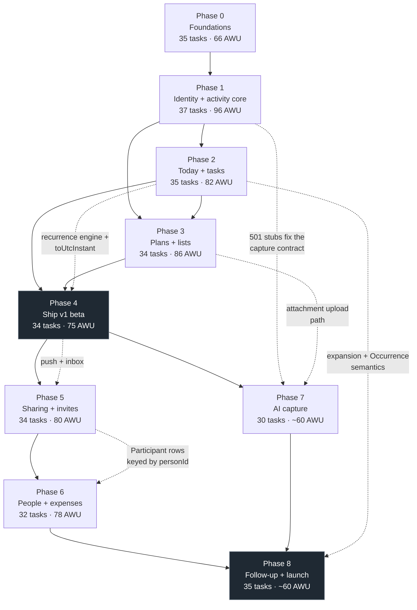

# Implementation roadmap

**Status:** canonical for phase ordering, dependencies, effort and parallelisation. Product
intent is owned by [`../01-product/`](../01-product/), architecture by
[`../02-architecture/`](../02-architecture/). This document does not restate either; it says
what gets built, in what order, by how many agents at once, and what "done" means.

Nine phases, numbered 0 through 8. **The numbering is fixed.** Phases are not renumbered,
merged, or split. A piece of work that does not fit its phase moves to the phase that owns
it — every phase document carries an explicit "out of scope for this phase" table naming the
owner, and those tables are the arbiter.

---

## 1. The nine phases

| # | Name | Ships to a real user | Doc |
| --- | --- | --- | --- |
| 0 | Foundations | Nothing. A running system with no product in it. | [`phase-00-foundations.md`](phase-00-foundations.md) |
| 1 | Identity and the activity core | An account, and things you can save and find again. | [`phase-01-activity-core.md`](phase-01-activity-core.md) |
| 2 | Today and tasks | A daily-use planner. | [`phase-02-today-and-tasks.md`](phase-02-today-and-tasks.md) |
| 3 | Plans and lists | The third noun, and the loop between them. | [`phase-03-plans-and-lists.md`](phase-03-plans-and-lists.md) |
| 4 | Ship v1 (private beta) | Other people, on TestFlight and the web. | [`phase-04-ship-v1.md`](phase-04-ship-v1.md) |
| 5 | Sharing and invites | Plans with other people in them. | [`phase-05-sharing.md`](phase-05-sharing.md) |
| 6 | People and expenses | Who owes whom. | [`phase-06-people-and-expenses.md`](phase-06-people-and-expenses.md) |
| 7 | AI capture | Type it, photograph it, paste it. | [`phase-07-ai-capture.md`](phase-07-ai-capture.md) |
| 8 | Follow-up, personalisation and public launch | The App Store. | [`phase-08-followup-and-launch.md`](phase-08-followup-and-launch.md) |

### 1.1 Phase 0 — Foundations

An AWS account on the Paid Plan with budget alarms firing on the first cent, the domain
registered, CDK bootstrapped, and eight stacks synthesising. A five-workspace monorepo that
builds, lints, type-checks and tests in one command. One Lambda behind an HTTP API answering
`GET /v1/health`, and an Expo app that renders on the iOS simulator and in a browser from
the same source file and calls that endpoint through the shared typed client. GitHub Actions
deploys dev on merge and prod on tag, with no long-lived AWS key anywhere. **35 tasks.**

### 1.2 Phase 1 — Identity and the activity core

Cognito end to end: sign-up with email verification, sign-in, Sign in with Apple, refresh
with rotation and a single-flight lock, and the two different token-storage strategies for
iOS and web. A post-confirmation trigger creates the DynamoDB profile that is the tenant key
for every later request. The repository layer exists with key construction confined to one
file. Activity CRUD is complete: create, read, patch with optimistic concurrency, delete with
its cascade, duplicate, filtered list. The unified Add screen and all six progressive
creation forms work. `/v1/capture/*` returns `501` from a handler the client is already
written against. **37 tasks.**

### 1.3 Phase 2 — Today and tasks

The recurrence engine — pure, isolated, 100% branch coverage, correct across DST in both
hemispheres and across month-end. `GET /v1/agenda` returns everything Today renders in one
call, with series expanded and occurrence overrides applied. Complete, uncomplete, skip,
snooze and reschedule, with occurrence scoping that provably never touches the series. The
Today screen with all four sections, the one-minute UP NEXT ticker, swipe actions, six-second
undo, overdue roll-forward, passed-plan prompts, an offline mutation queue, and local
reminders on device. **35 tasks.**

### 1.4 Phase 3 — Plans and lists

Lists, list items, and the eight closed kinds. The Lists → Plans bridge that links rather
than duplicates, with bidirectional title mirroring and the full link lifecycle on complete,
skip, unschedule and delete. Watchlist progress and its single automatic status transition.
Meal ingredients to groceries with stored provenance labels and the duplicate rule. Prep
tasks as child activities that survive their parent's deletion. The plan detail screen in
full, the plan → list suggestion sheet, the updates feed, and image upload through presigned
URLs served by CloudFront. **34 tasks.**

### 1.5 Phase 4 — Ship v1 (private beta)

Prod web hosting with an enforcing CSP. EventBridge Scheduler and a reminder Lambda
delivering push through Expo, with quiet hours and the deferred permission pre-prompt. The
EAS build and submit pipeline, an App Store Connect record, privacy nutrition labels,
screenshots, review notes and a demo account, and external TestFlight testers who are not the
founder. In-app account deletion with re-authentication and a 30-day purge. A force-upgrade
kill switch. Measured performance and accessibility passes, and a rehearsed rollback.
**34 tasks.**

### 1.6 Phase 5 — Sharing and invites

An owner adds people to any activity from one picker. App users get an in-app invitation, a
push, and the plan on their own Today with a pending RSVP; everyone else gets a public link
that works with no account and no install, where they answer Going / Maybe / Can't go and add
the plan to Google or Apple Calendar in three taps. `.ics` export with stable `UID`s and
incrementing `SEQUENCE`. Every change to a shared plan writes to that plan's updates feed and
notifies the people who need to know. SES leaves the sandbox on a domain passing DKIM, SPF
and DMARC, so guest invitations arrive. A guest who later signs up with the same verified
email finds their plans already there rather than a second copy — which is why the phase also
adds the `GUESTEMAIL#` lookup partition, because linking without it would require a `Scan`.
The public projection is a separate, allow-listed DTO built field by field and is the one
part of the system a stranger can reach, so it is isolated by five independent mechanisms.
See [`phase-05-sharing.md`](phase-05-sharing.md). **34 tasks.**

### 1.7 Phase 6 — People and expenses

The money feature answers exactly one question: we did something together, who owes whom?
Expenses on shared plans with equal, exact and shares splits whose arithmetic reconciles to
the cent in integer minor units, with no float anywhere in the path and property-based tests
that make success criterion S7 a gate rather than a claim. A per-person owes summary and a
suggested settle-up that drills through to the expenses behind it. A People layer derived
only from shared plans — no contact import, no friend graph, no follows — with a People page,
a Person view, and pairwise net balances that are always tappable through to the individual
rows that produced them. Settlement is recorded against specific expense IDs, never as a bare
number. DynamoDB Streams turn on and a worker keeps the `Balance` cache fresh with a
dead-letter queue, a divergence alarm, and the ability to rebuild any balance from source at
any time. Guests with no account participate in all of it, keyed by `personId`. See
[`phase-06-people-and-expenses.md`](phase-06-people-and-expenses.md). **32 tasks.**

### 1.8 Phase 7 — AI capture

The three `/v1/capture/*` endpoints stop returning `501`. Natural-language parse turns
`Watch Severance with Alice Friday at 8` into a draft with per-field confidence and character
spans; image extraction reads a poster, a flyer or a screenshot into an event draft; link
parsing does the same for a pasted URL. All three return a `ParsedCapture` **draft** and none
of them writes — the server never creates an Activity from a parse result, which is a product
rule, a security property, and an integration test asserting zero writes. The review screen
highlights every field below 0.7 confidence and blocks nothing. The model call sits behind a
`CaptureProvider` interface so the provider decision (open question OQ-5) and a later move to
Bedrock are one-file changes, with the API key in Secrets Manager. This is the first phase
with a marginal cost per use, so it also brings rate limits at 20 requests per hour, request
shaping, image downscaling before upload, a budget guard that degrades to the manual path
rather than overspending, and the answer to whether capture sits behind a paid tier
(OQ-6). Every screen built in Phase 1 already degrades to the manual path, so nothing in the
client is rewritten — that is what the `501` stubs bought. See
[`phase-07-ai-capture.md`](phase-07-ai-capture.md). **30 tasks.**

### 1.9 Phase 8 — Follow-up, personalisation and public launch

The lifecycle's last step gets its own phase. Completion-relative recurrence
(`mode: 'after_completion'`, three days after I last watered the plants) ships with the
semantics already fixed in
[`../01-product/today-and-tasks.md`](../01-product/today-and-tasks.md) §6.7, projecting at
most one future occurrence. Custom recurrence via RFC 5545 `rrule` lands, which is the only
reason a series can produce two occurrences on one date and therefore the reason the
expansion carries that warning. Frequently used Custom activities become **shortcuts** that
remember a typical time, recurrence, people and reminder — the personalisation feature the
concept names in §30 and the only consumer of `details.shortcutId`. Then the launch work:
widened App Store availability, the full App Review rather than Beta App Review, an App Store
listing that has to stand on its own, the 60-day GSI archival sweep running against real
data volume, load and cost verification against the projections in
[`../02-architecture/cost-model.md`](../02-architecture/cost-model.md), and the operational
readiness — alarm tuning, runbook rehearsal, support routing — that turns a private beta into
something strangers can rely on. See
[`phase-08-followup-and-launch.md`](phase-08-followup-and-launch.md). **35 tasks.**

---

## 2. Dependency graph

Solid edges are hard ordering. Dotted edges are the interfaces a later phase depends on
being right, which is where the cost of a Phase 2 mistake actually lands.

Two edges deserve explanation because they are not obvious:

- **Phase 3 depends on Phase 2, not only on Phase 1.** The link lifecycle in
  [`../01-product/plans-and-lists.md`](../01-product/plans-and-lists.md) §6.3 is defined in
  terms of completion, un-completion and skip, which do not exist until Phase 2. Building
  lists first would mean building the bridge twice.
- **Phase 7 depends on Phase 4, not on Phase 6.** Capture needs the attachment upload path
  (Phase 3), the shipped client's degraded paths (Phase 1), and a production environment with
  a secret store and cost alarms (Phase 4). It needs nothing from sharing or expenses, so if
  capture becomes more commercially urgent than expenses, 6 and 7 can swap — and the phase
  numbers stay as they are.

---

## 3. What ships, and the demo

| Phase | What a real user gets | The demo you could give |
| --- | --- | --- |
| **0** | Nothing. This phase is honest about that. | Open a terminal: one command builds, tests and type-checks five workspaces. `curl https://api.dev.ordinarydays.app/v1/health` returns the SHA of the commit you just merged. The same screen renders on the simulator and in a browser from one file. Push a tag and watch a prod deploy block on an approval gate. |
| **1** | An account and a place to put things. Sign in on a phone or a laptop, save a meal, a show, an appointment, a task; find them again; edit them; delete them. | Sign up on the phone. Tap Add, type `Dentist`, tap Event, add a date and a location, Save. Open it, change the type to Outing, and watch the app tell you exactly which fields it will drop before it drops them. Sign in on the laptop and it is all there. |
| **2** | A planner you open every morning. | Show Today at 3 PM on a real day: UP NEXT, the schedule, the untimed things, and what already happened. Tick today's Gym. Open tomorrow — Gym is still there at six. Snooze tonight's task to eight; tomorrow's is still at six. Put the phone in airplane mode, tick three things, kill the app, come back online, and all three are on the server exactly once. |
| **3** | The full personal loop. Save things with no date; schedule them when you decide; let a plan generate the lists it needs. | Add `Severance` to the watchlist, set it to S2 E4, schedule it — the sheet offers S2 E5 because you have seen E4. Watch it, and the watchlist updates itself. Separately: create a New York trip, add two prep tasks, let it suggest a packing list, and see `Book hotel` land on Today on its own date with `New York Trip` underneath it. |
| **4** | The app, on their phone, from TestFlight, with reminders that fire. | Send someone a TestFlight link. They install, sign in with Apple in one Face ID prompt, set a reminder for two minutes out, lock the phone, and the notification arrives with the task's own words in it. Then delete the account from inside the app, and sign back in the next day to find everything restored. |
| **5** | Plans with other people in them, including people who will never install anything. | Add a friend to Saturday dinner. If they have the app, it appears on their Today with Going / Maybe / Decline. If they do not, they get a link that opens a page with the plan on it, they tap Going, and it is on your plan thirty seconds later with no account and no download. Then they add it to their own calendar. |
| **6** | The end of the group-trip spreadsheet. | Four people, a weekend, six expenses, three payers, one uneven split. Open the plan: `You are owed $121.50`. Tap the number and every expense that produced it is there. Settle two of them and the balance changes by exactly the right amount, to the cent. |
| **7** | Capture that takes a second instead of a form. | Photograph a gig poster on the wall. The review screen comes back with the title, the date, the venue and the price filled in, with the two fields it is unsure about highlighted. Change one, confirm, and it is a plan. Nothing was created until you said so. |
| **8** | A finished product on the App Store. | Search the App Store, install it, and be at a populated Today in three minutes with no configuration. Set a plant-watering task to repeat three days after you last did it. Turn `Practice guitar` into a shortcut and add it with two taps. |

---

## 4. Effort

### 4.1 The unit

Effort is given in **agent-work-units (AWU)**, not calendar time.

> **Decision:** one AWU is one focused agent session that produces one reviewable pull
> request — roughly 200–600 lines of code and tests against a task that is already specified
> — plus the founder's review of it. Task sizes map as **S = 1, M = 2, L = 4**.

AWU counts wall-clock-agnostic work, so they do not change when you run more agents in
parallel; the elapsed time does.

### 4.2 Per phase

| Phase | Tasks | S / M / L | AWU | Elapsed (see assumption) |
| --- | --- | --- | --- | --- |
| 0 | 35 | 14 / 16 / 5 | **66** | ~3.5 weeks |
| 1 | 37 | 4 / 20 / 13 | **96** | ~5 weeks |
| 2 | 35 | 6 / 20 / 9 | **82** | ~4 weeks |
| 3 | 34 | 2 / 22 / 10 | **86** | ~4.5 weeks |
| 4 | 34 | 7 / 20 / 7 | **75** | ~4 weeks |
| **0–4 subtotal** | **175** | | **405** | **~21 weeks (~5 months)** |
| 5 | 34 | 6 / 19 / 9 | **80** | ~4 weeks |
| 6 | 32 | 2 / 22 / 8 | **78** | ~4 weeks |
| 7 | 30 | 3 / 15 / 12 | **~60** | ~3 weeks |
| 8 | 35 | 1 / 23 / 11 | **~60** | ~2.5 weeks |
| **Total 0–8** | **306** | | **~683** | **~34 weeks (~8 months)** |

### 4.3 The elapsed-time assumption, stated explicitly

The weeks column assumes:

1. **One founder**, working roughly **25 hours a week** on this, not full time.
2. **Two to three coding agents running concurrently**, on tasks marked parallel-safe.
3. **Review is the bottleneck, not generation.** The founder reads every diff. An agent can
   produce four AWU of code in the time it takes to review one badly, and reviewing badly is
   how a recurrence bug ships.
4. A sustained throughput of **~20 AWU per week**. That is not 20 tasks: it is roughly 10–14
   tasks depending on the size mix.
5. **Rework is included** in the AWU figure at about 20%. A task that comes back once is
   normal; a task that comes back three times means the task was underspecified, which is a
   defect in this document, not in the agent.
6. **No calendar dependencies are included.** Apple Developer enrolment, SES production
   access, App Review and Beta App Review all involve waiting on someone else. Phase 4's
   elapsed figure assumes enrolment completed during Phase 1 as instructed; if it did not,
   add one to three weeks and possibly more.

If any of those assumptions is wrong, scale the elapsed column and leave the AWU column
alone. AWU is the estimate; weeks are a projection built on top of it.

---

## 5. Parallelisation

### 5.1 Between phases

| Boundary | Rule |
| --- | --- |
| 0 → 1 | **Serial.** Nothing in Phase 1 can be reviewed against a working deploy until Phase 0 has one. |
| 1 → 2 | **Serial for the API and shared package**; the recurrence engine (P2-01) is the exception — it is pure, depends on nothing in Phase 1, and should be started as early as an agent is free. Starting it during Phase 1 is the single highest-value overlap in the plan. |
| 2 ↔ 3 | **Partially overlapping.** Phase 3's shared-package and repository work (P3-01, P3-02, P3-03) depends only on Phase 1 and can run alongside Phase 2. Everything in Phase 3 that touches completion or the agenda must wait. |
| 3 → 4 | **Serial**, except the calendar-bound items: Apple enrolment, App Store Connect setup, screenshots, the privacy policy and the support page can all be done during Phase 3 and should be. |
| 4 → 5 | **Serial.** Phase 5 needs push and the inbox from Phase 4. |
| 5 → 6 | **Serial.** Expenses are keyed to `Participant`/`Person` rows that Phase 5 creates. |
| 6 ↔ 7 | **Independent of each other.** Both depend on Phase 4 and neither depends on the other. Run whichever is more urgent; run both if there is capacity. |
| 7, 6 → 8 | **Serial.** Launch is last. |

### 5.2 Within a phase

The `parallel-safe` column in each phase's task table is the authority. The general rules
behind it:

**Safe to run concurrently:**

- Tasks in **different workspaces** that share no file: an `infra` stack, a `packages/ui`
  primitive and a `services/api` route touch nothing in common.
- **Pure functions in `packages/shared`** — the recurrence engine, `lexoRankBetween`, the
  type-change mapping, the provenance label, the money splitters. Each is one file plus one
  test file with no shared state, and each is the highest-value thing to hand an agent
  because it is fully specified and fully testable.
- **One CDK stack per agent.** Stacks reference each other through typed props, not shared
  files.
- **One route file per agent**, once the middleware chain exists.
- **Screens that do not share a feature directory.** Two agents in
  `src/features/agenda/` will conflict; one in `agenda/` and one in `lists/` will not.
- **Documentation, test fixtures and E2E flows** alongside anything.

**Must be serial:**

- Anything that edits **`services/api/src/app.ts`** or the middleware chain. It is one file
  that everything mounts into. Sequence these; they are small.
- Anything that edits **`services/api/src/repositories/keys.ts`**. One file, deliberately.
- Anything that changes a **shared Zod schema an in-flight task is consuming**. Land the
  schema first, then the consumers.
- **`docs/generated/openapi.json`** — it is generated and checked in, so two branches
  regenerating it always conflict. Regenerate at merge, not in the branch.
- **`pnpm-lock.yaml`.** Two agents adding dependencies in parallel produce a lockfile
  conflict that is tedious to resolve correctly. Batch dependency additions.
- **CDK deploys.** `deploy-dev.yml` uses `concurrency` without `cancel-in-progress`
  precisely because a cancelled CloudFormation deploy leaves a stack in
  `UPDATE_IN_PROGRESS`. Deploys queue; that is correct.
- The **recurrence engine and its test matrix** (P2-01, P2-02). One agent, one head, one
  model of the problem. Splitting the rules across agents is how the daily rule and the
  weekly rule end up disagreeing about what `startDate` means.
- Anything touching **`app.config.ts`** or **`eas.json`** during Phase 4.

**A useful default:** put one agent on the API vertical, one on the client vertical, and one
on pure `packages/shared` work. Those three streams collide rarely and each produces
independently reviewable PRs.

---

## 6. The definition of done

> **A phase is not done when its tasks are merged. A phase is done when every one of its
> numbered acceptance criteria passes, observably, by someone who has not read the code, and
> the repository-wide definition of done in
> [`definition-of-done.md`](definition-of-done.md) is met for every task in it.**

Both conditions, not either. Consequences that are enforced in review:

1. **Acceptance criteria are checked, not asserted.** Each phase's numbered list is written
   so that a person with a terminal, a browser and a phone can verify every item without
   opening an editor. Walk the list; record the result; a criterion that cannot be checked
   that way is a defect in the criterion and is rewritten before the phase closes.
2. **A criterion that cannot pass yet blocks the phase.** It does not get deferred into the
   next phase's backlog. If the criterion turns out to be wrong, change it deliberately, in
   a pull request, with the reasoning — do not quietly drop it.
3. **The out-of-scope table is binding in both directions.** Work claimed by a later phase
   does not get pulled forward "since we're in there anyway", and work that belongs to this
   phase does not get pushed out to make the phase look finished.
4. **Coverage gates are phase gates.** `packages/shared/src/recurrence/**` and
   `.../money/**` are held at 100% statements and branches. A phase does not close under a
   threshold, and a threshold is never lowered to close a phase.
5. **The canonical docs are updated in the same pull request** as any code that changes them.
   Several tasks explicitly require an amendment to `data-model.md` or `api-contract.md`
   (the `GUESTEMAIL#` partition, `overdueFromDate`, the web auth endpoints, the
   user-scoped idempotency key, `icsSequence`). A phase with a documented amendment still
   pending is not done.
6. **`docs/generated/openapi.json` is current**, CI is green on `main`, and dev is deployed
   from that commit.

---

## 7. Risk register

The five highest-risk items across the whole plan, ranked by expected cost — probability
multiplied by how expensive the item is to fix once it has shipped.

### R1 — The recurrence engine is subtly wrong

**Phase 2. The single highest-risk item in the plan.**

Recurrence is the one piece of logic that is both mathematically fiddly and invisible when
wrong. A month-end bug shows up once a quarter. A DST bug shows up twice a year. Both look
like the user misremembering, and by the time three people report it there are `Occurrence`
rows, reminders and completion history built on the wrong dates.

| Trigger signals | Mitigation |
| --- | --- |
| A test in `recurrence/` is skipped, marked `todo`, or has its expectation edited to match the output | Build it **first and alone**, before any consumer. One agent, one head. |
| The coverage threshold on `recurrence/**` is lowered, even to 99% | The 100% statement and branch gate is configured in Phase 0 (P0-26), against a placeholder file, *before* the first line exists — so it can never be "added afterwards and tuned to fit". |
| `+ 86400000`, `setDate(d.getDate() + 1)` on a UTC `Date`, or any millisecond arithmetic appears in `recurrence/` | Wall-clock calendar arithmetic only, in `calendar.ts`. Millisecond date-stepping in that directory is an automatic review rejection. |
| A bug report mentions a specific month or a specific weekend in March or November | The 36-case matrix in P2-02 covers both hemispheres, a half-hour offset zone, the spring-forward gap, the fall-back ambiguity, four month-end variants and timezone travel. Plus 1,000 property-based cases and an independent cross-check implementation in the test file. |
| The engine reads or writes anything | It is pure and takes four arguments. A `Date.now()` in it fails the determinism test. |

**If it happens anyway:** the engine is pure and isolated, so the fix is one file and the
blast radius is bounded by the golden fixtures. That containment is the reason for the
isolation, and it only holds if the isolation is real.

### R2 — App Store rejection at the worst possible moment

**Phase 4, with roots in Phase 1.**

Every rejection costs a full review cycle, and the two that matter most for this app are
both *policy* problems that look like they can be solved late and cannot.

| Trigger signals | Mitigation |
| --- | --- |
| Apple Developer enrolment is still pending when Phase 4 starts | Enrolment starts on **day one of Phase 1**. Individual enrolment takes days; organisation enrolment with a D-U-N-S number can take weeks. Phase 1 also needs it for Sign in with Apple. |
| Sign in with Apple works on dev and has never been tested on a production build | Guideline 4.8 is checked at review, not at submission. The prod bundle identifier must match the registered App ID exactly, and both Cognito hosted-UI domains must be on the Apple Services ID. Test on the TestFlight build. |
| Account deletion is "on the list for after the beta" | Guideline 5.1.1(v) requires in-app deletion, is checked at review, and is a large task (soft delete, token revocation, schedule cleanup, 30-day purge, S3 cleanup). It is built early in Phase 4, not last. |
| Privacy labels are filled in from memory rather than from the dependency list | Under-declaring is a rejection. P4-24's table is derived from a grep of `apps/mobile/package.json`. |
| The demo account is empty, expired, or requires an email code the reviewer cannot receive | Pre-seeded, pre-confirmed, non-expiring, on prod, with review notes naming the account-deletion path explicitly. |

**If it happens anyway:** each rejection is roughly one to two weeks. The mitigation is
front-loading — every item above is doable during Phases 1–3 and costs almost nothing then.

### R3 — One codebase, two platforms turns into two codebases

**Phases 1 through 4, continuously.**

React Native Web is the decision that makes a solo founder able to ship iOS and web at all
(ADR-001). It fails gradually: a `.web.tsx` here, a `Platform.OS` branch there, until half
the screens exist twice and every feature costs double.

| Trigger signals | Mitigation |
| --- | --- |
| A new `.web.tsx` or `.ios.tsx` file appears that is not on the sanctioned list in [`../02-architecture/tech-stack.md`](../02-architecture/tech-stack.md) §3.5 | The list is short and explicit: storage, push, the date picker, haptics. Adding to it is a decision with a written reason, not a convenience. |
| A file is more than about 30% platform branches | Split it — but ask first whether the divergence is real. A file with one branch should not be split. |
| A web bug is fixed by changing a component that iOS also uses, with no iOS check | Playwright runs on every dev deploy; Maestro runs on the manual workflow before any TestFlight build. Both flows cover the same journeys. |
| `Dimensions.get()` at module scope, or an absolute pixel layout | Flexbox and `maxWidth` only, read through `useBreakpoint()`. |
| `expo-doctor` failures are ignored, or React versions drift between `apps/mobile` and `packages/ui` | `syncpack` and `expo-doctor` both run in `ci.yml` from Phase 0. Version drift produces invalid-hook-call errors that cost a day to diagnose. |

**If it happens anyway:** the recovery is expensive — the alternative is a second Next.js app,
which one person cannot maintain. Prevention is the only strategy, and it is cheap.

### R4 — An AWS cost or account surprise

**Phase 0, with a long tail.**

The entire cost model depends on paying only per request. Two distinct failure modes: the
account closing, and the bill arriving.

| Trigger signals | Mitigation |
| --- | --- |
| Billing → Free tier shows the account plan as **Free** | The account is on the **Paid Plan** from signup (P0-01 step 9). The Free Plan closes the account after six months. Re-verified at the end of Phase 0 and again in Phase 2. |
| The zero-spend budget fires | Created **before** any resource is deployed (P0-03), plus Cost Anomaly Detection. The permanent $5/$20 budgets come with `AccountStack`. |
| `AWS::EC2::NatGateway` appears in any synthesised template | No Lambda is ever in a VPC. A CDK assertion test fails the build on it. A NAT gateway is ~$32/month and the single most common source of an unexpected serverless bill. |
| A log group is created without an explicit retention setting | The default is "never expire", which is how a hobby account accumulates a storage bill. Every log group's retention is set in the `NodeLambda` construct and asserted. |
| Lambda `Invocations` exceed 10,000 in an hour, or `Throttles` fire | Reserved concurrency, API Gateway throttling and per-user rate limits are the things that actually stop spend; budgets only notify. |
| The Phase 7 model spend is unbounded | Capture is rate-limited at 20/hour, images are downscaled before upload, and the budget guard degrades to the manual path rather than overspending. Open question OQ-6 decides whether it sits behind a paid tier. |

**If it happens anyway:** an account closure at month six with data in it is the worst
version and is entirely preventable by one dropdown in Phase 0. A surprise bill is capped by
the concurrency and throttle guardrails, which are deployed from Phase 0.

### R5 — The single-table key design does not support a pattern discovered later

**Phases 1 through 6.**

DynamoDB's single-table design is fast and cheap for the access patterns you enumerated and
awkward for the one you did not. `data-model.md` §5 lists sixteen patterns and forbids
`Scan`. Two patterns have already been discovered mid-flight and written up as open
questions before a line of code exists: `GUESTEMAIL#` for guest linking (OQ-9) and the
user-scoped idempotency key. There will be more.

| Trigger signals | Mitigation |
| --- | --- |
| A pull request contains a `ScanCommand` outside `infra/scripts/migrations/` | Automatic rejection, enforced by a test that greps the built API bundle. |
| A query filters a large result set client-side to find a few rows | That is a `Scan` wearing a costume. Add the access pattern to §5 with its key design, in the same PR. |
| A second GSI is proposed | Every extra index is a second write on every mutation. One GSI is a deliberate constraint; adding a second is a decision with a written reason. |
| A new key pattern is added to `keys.ts` without a row in §5 | The rule is stated in the data model: add the row **before** writing the code. |
| A `GSI1` projection change is proposed | Changing a GSI projection requires replacing the index. `INCLUDE` with the `AgendaItem` field list is pinned by a CDK assertion test from Phase 0 for exactly this reason. |

**If it happens anyway:** the migration policy in
[`../02-architecture/infrastructure.md`](../02-architecture/infrastructure.md) §4.5 covers
it — additive attributes need nothing, shape changes use upgrade-on-read, and a key change is
two deploys with an idempotent backfill script. The cost is bounded as long as the pattern is
added deliberately rather than papered over with a filter.

---

## 8. Related documents

| Document | Covers |
| --- | --- |
| [`definition-of-done.md`](definition-of-done.md) | The per-task bar every phase's tasks must clear: tests, coverage, docs, review, deploy. |
| `phase-00-foundations.md` through [`phase-08-followup-and-launch.md`](phase-08-followup-and-launch.md) | Goal, prerequisites, deliverables, tasks, acceptance criteria, scope guards and risks per phase. Phases 7 and 8 are written alongside the Phase 5 and 6 sibling set. |
| [`../02-architecture/decisions.md`](../02-architecture/decisions.md) | ADR-001 to ADR-030, plus the twelve open questions and the phase each must be decided by. |
| [`../02-architecture/cost-model.md`](../02-architecture/cost-model.md) | What each phase costs to run, and the guardrails. |
| [`../01-product/overview.md`](../01-product/overview.md) §7 | Success criteria S1–S10, which the phase acceptance criteria operationalise. |
</content>
