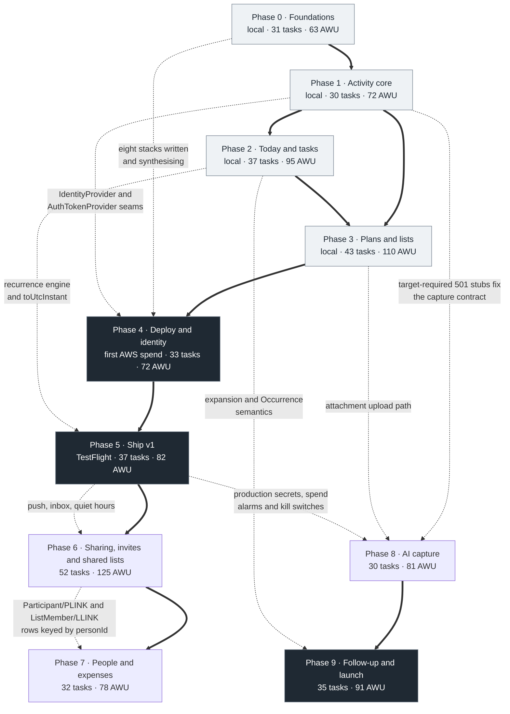

# Implementation roadmap

**Status:** canonical for phase ordering, dependencies, effort and parallelisation. Product
intent is owned by [`../01-product/`](../01-product/), architecture by
[`../02-architecture/`](../02-architecture/). This document does not restate either; it says
what gets built, in what order, by how many agents at once, and what "done" means.

Ten phases, numbered 0 through 9. **The numbering is fixed.** Phases are not renumbered,
merged, or split. A piece of work that does not fit its phase moves to the phase that owns
it — every phase document carries an explicit "out of scope for this phase" table naming the
owner, and those tables are the arbiter.

The shape of the plan in one sentence: **Phases 0–3 build the whole single-player product on
a laptop with nothing deployed and no real authentication; Phase 4 is the first deploy and
the first real user; Phase 5 gives the system a name and ships it to TestFlight; Phases 6–9
build the multi-player half and launch it.** Section 3 states the boundary exactly.

---

## 1. The ten-phase picture

| # | Title | What a real user can do at the end | The demo you could give |
| --- | --- | --- | --- |
| **0** | [Foundations (local only)](phase-00-foundations.md) | Nothing. This phase is honest about that. | One command builds, lints, type-checks and tests five workspaces. `curl http://localhost:3000/v1/health` returns `200` with `stage: "local"`. The same screen renders on the simulator, in a browser and on a physical iPhone over the LAN from one source file. `cdk synth` emits eight templates with `AWS_PROFILE` unset. One throwaway stack deploys through GitHub OIDC and is destroyed. The AWS bill is $0.00. |
| **1** | [The activity core](phase-01-activity-core.md) | A place to put things — on the developer's laptop only. Explicitly choose Task or Plan and, for a Plan, General / Meal / Watch / Event; find it again; edit it; delete it. | `pnpm dev`. Tap Add → Plan → Event, type `Dentist`, add a date, location and reservation, Save. Open it, change the type to Watch, and the app names the reservation and Event fields it will drop before it drops them. The same words entered through Add → Task create a Task instead; text never changes the selected target. No account, no network, no AWS. |
| **2** | [Today and tasks](phase-02-today-and-tasks.md) | A planner you open every morning. | Today at 3 PM on a real day: UP NEXT, SCHEDULE, ANYTIME, EARLIER TODAY. Tick today's Gym; tomorrow's is still at six. Snooze tonight's task to eight; tomorrow's is unchanged. Airplane mode, tick three things, kill the app, come back online, and all three land exactly once. |
| **3** | [Plans and lists](phase-03-plans-and-lists.md) | The full personal loop. Save things with no date; explicitly turn a list item into a Plan when you decide; let a plan suggest the lists it needs. | Create a list by choosing **TV shows** from the unselected style catalogue, add `Severance` at S2 E4, then tap **Plan this item** and explicitly choose **Watch**; the form offers S2 E5 as a field pre-fill, not as a type guess. Watch it and accept the separate progress suggestion. Create a New York trip, add two prep tasks, explicitly choose **Packing** for its list, and see `Book hotel` land on Today with `New York Trip` underneath it. |
| **4** | [Deploy and identity](phase-04-deploy-and-identity.md) | An account of their own, on a system that runs on AWS rather than on your laptop. | Sign up on the simulator, receive the code, confirm, sign in. Sign in with Apple on a physical device, including Hide My Email. `curl "$API_URL/v1/health"` against the dev `execute-api` endpoint returns the SHA of the commit you merged five minutes ago. Ask for another user's activity by ID and get `404` with nothing in the body. |
| **5** | [Ship v1](phase-05-ship-v1.md) | The app on their phone from TestFlight, at a real domain, with reminders that fire. | Send someone a TestFlight link. They install, sign in with Apple in one Face ID prompt, set a reminder two minutes out, lock the phone, and the push arrives with the task's own words in it. Then they delete the account from inside the app and sign back in the next day to find everything restored. |
| **6** | [Sharing, invites and shared lists](phase-06-sharing.md) | Plans and lists with other people in them, including people who will never install anything. | Add a friend to Saturday dinner. With the app, it appears on their Today with Going / Maybe / Decline. Without it, they get a link that opens the plan with no account and no install, they tap Going, and it is on your plan thirty seconds later. Share a grocery list with your housemate, then each use **Plan this item → Event → Just me** on the same row; each sees only their own Plan. Choose people on another item and only the people explicitly selected join it. |
| **7** | [People and expenses](phase-07-people-and-expenses.md) | The end of the group-trip spreadsheet. | Four people, a weekend, six expenses, three payers, one uneven split. Open the plan: `You are owed $121.50`. Tap the number and every expense behind it is there. Mark two selected obligations settled; the app asks for no amount, method, note, reference, or other external payment detail, and the remaining balance changes by exactly the right amount, to the cent. |
| **8** | [AI capture](phase-08-ai-capture.md) | Capture that takes a second instead of a form. | Choose **Plan → Event**, then photograph a gig poster. The review screen echoes that target and returns only compatible fields — title, date, venue and price — with uncertain ones marked. There is no intent classifier and no suggested destination or type. Change one, confirm, and it is an Event Plan. Nothing was written until you said so, and an integration test asserts it. |
| **9** | [Follow-up, personalisation and public launch](phase-09-followup-and-launch.md) | A finished product on the App Store. | Search the App Store, install, and be at a populated Today in three minutes with no configuration. Set a plant-watering task to repeat three days after you last did it. Turn `Practice guitar` into a shortcut and add it in two taps. Send a link from Safari's share sheet without opening the app. |

### 1.1 Phase 0 — Foundations (local only)

A five-workspace monorepo that installs, builds, lints, type-checks, tests and
dependency-checks from a clean clone in one command. One Lambda-shaped Hono app answering
`GET /v1/health` on the Node adapter at `localhost:3000`, DynamoDB Local holding a table
whose key schema is generated from the same definition the CDK stack uses, and an Expo app
that renders the response on the iOS simulator, in a browser and on a physical iPhone over
the LAN — all from one `app/(app)/index.tsx`. Eight CDK stacks are **written** and
synthesise with no AWS credentials, so the infrastructure cannot rot while the product is
built locally. The AWS account is open, hardened and budgeted because that takes an hour and
is worth having before anyone is under deadline pressure. The phase ends with a single
throwaway stack deployed through the real GitHub OIDC path and immediately destroyed.
**31 tasks.**

### 1.2 Phase 1 — The activity core

The repository layer — key construction confined to one file, transactions, opaque cursors,
upgrade-on-read — against DynamoDB Local, and the Activity fully implemented behind it:
create, read, patch with optimistic concurrency, delete with its cascade, duplicate, and the
flat filtered list. The unified Add screen begins with an explicit `CreationTarget`: Task is
`{ objectKind: 'task', type: 'task' }`; Plan requires the user's visible `PlanType`. There is
no title-only create and no server default. The detail screen has inline edit, explicit
Task↔Plan conversion, change-type with its loss confirmation, duplicate and delete.
`rateLimit` and `idempotency` middleware. `/v1/capture/*` returns `501` behind request schemas
that already require `creationTarget`, so Phase 8 fills fields within a settled destination
instead of adding an intent classifier or changing client routing.

There is no authentication. There is instead the **identity seam**: every item is keyed
`USER#<userId>` exactly as
[`../02-architecture/data-model.md`](../02-architecture/data-model.md) §3.2 specifies, and
the user ID comes from an `IdentityProvider` that returns a constant in this phase.
Deferring identity is not deferring `ownerId`. **30 tasks** — 29, plus P1-30 and P1-31
appended by the pre-scheduling phase-gate audit on 2026-08-08, less P1-19, which that audit
found had already shipped in P0-20.

### 1.3 Phase 2 — Today and tasks

The recurrence engine — pure, isolated, 100% statement and branch coverage, correct across
DST in both hemispheres and across month-end. `GET /v1/agenda` returns everything Today
renders in one call, with series expanded, occurrence overrides applied and tasks rolled
forward from the last 30 days. Complete, uncomplete, skip, snooze and reschedule, with
occurrence scoping that provably never writes `ACT#/META`. The Today screen with all four
sections, the one-minute UP NEXT ticker, swipe actions that are also accessibility actions,
a six-second undo, passed-plan prompts, a persisted offline mutation queue, and local
reminders scheduled on device. This is the phase where the product becomes usable daily —
still entirely on the laptop. **37 tasks.**

### 1.4 Phase 3 — Plans and lists

Lists and list items as independent collections: three behaviours and an unbounded template
catalogue on top. The selected record's behaviour, capabilities, slot, icon and empty-state
copy are copied onto the row at creation, so adding a list style is a config entry and later
catalogue edits cannot rewrite an existing List. Every general New list flow starts with that catalogue unselected and
`POST /v1/lists` requires the exact user-selected `templateKey`; title, source Plan and model
output never choose or rank it. Default slots and the four-step resolution that decides where
an explicitly invoked "add these ingredients" operation goes. `lexoRankBetween`, so
reordering is a single-item write. The optional **Plan this item** bridge requires an explicit
Plan `CreationTarget` and writes `LNK#<viewer>#<item>` rather than a global
`linkedActivityId`; title fields copy once and never mirror. The full viewer-projection
lifecycle covers complete, skip, unschedule and delete. Watch progress changes only after a
named follow-up is tapped; `want → watching` is explicit and undoable. Meal ingredients go to a chosen list with stored provenance
labels and the duplicate rule. Prep tasks as child activities that survive their parent's
deletion. The plan detail screen with all ten sections, the plan → list suggestion sheet, the
updates feed, and attachments through presigned uploads. After this phase a list that never
becomes a plan is a finished thing, and one that does becomes a plan without duplication — on
one laptop and one phone. **43 tasks** (a 44th, P3-11, was cut on 2026-08-07).

### 1.5 Phase 4 — Deploy and identity

The hinge. Four stacks — `AccountStack`, `DataStack`, `AuthStack`, `ApiStack` — deployed to
dev from a GitHub Actions workflow assuming a short-lived OIDC role, plus
`ObservabilityStack` with a confirmed SNS subscription. Cognito issues real tokens; the
post-confirmation trigger creates the profile that is the tenant key for every later
request; `CognitoIdentityProvider` slots into the Phase 1 seam so that no route handler,
service or repository changes. Sign-up with email verification, sign-in, Sign in with Apple,
forgot-password and sign-out, with the Keychain on iOS and an `HttpOnly` refresh cookie on
web, single-flight refresh and one retry on `401`. A cross-tenant suite in which every
request for a second user's data returns `404`.

It is also the phase where four phases of local-only development are audited against
reality: the divergence checklist (P4-15) is a task with a budget, not paperwork. No domain,
no CloudFront, no web hosting, no prod — the API is reached at `execute-api` and Cognito at
its default hosted-UI domain. **33 tasks.**

### 1.6 Phase 5 — Ship v1

`ordinarydays.app` registered, `DnsStack` issuing both certificates, the API on
`api.ordinarydays.app`, and the web build served from CloudFront behind a real Content
Security Policy shipped report-only first. A prod environment for the first time, deployed
from a tag behind an approval gate. `SchedulerStack` and a reminder Lambda delivering push
through Expo with quiet hours and a deferred permission prompt, plus the in-app inbox with
no numeric badge anywhere. The EAS build-and-submit pipeline, an App Store Connect record,
privacy nutrition labels, screenshots, review notes and a demo account, and external
TestFlight testers who are not the founder. In-app account deletion with re-authentication
and a 30-day purge, data export, and a `426` force-upgrade kill switch. Measured performance
and accessibility passes, prod alarms, and one rehearsed rollback. **37 tasks.**

What ships here is a **manual planner**: everything a tester sees, they typed in. Capture —
natural language and images, the product's differentiator — is Phase 8, deliberately, because
the capture endpoints need a settled activity model and a working review screen to confirm
into before a model integration is worth building. Do not describe this milestone as
feature-complete, and do not reorder the roadmap to close the gap
([`../02-architecture/decisions.md`](../02-architecture/decisions.md) ADR-036, ADR-008).

### 1.7 Phase 6 — Sharing, invites and shared lists

An owner adds people to a Plan from one picker. App users get an in-app invitation, a
push, and the plan on their own Today with a pending RSVP; everyone else gets a public link
that works with no account and no install, where they answer Going / Maybe / Decline — or
Interested / Maybe / Pass while the date is still being decided — and
add the plan to Google or Apple Calendar in three taps. `.ics` export with stable `UID`s and
incrementing `SEQUENCE`. Every change to a shared plan writes to that plan's updates feed
and notifies the people who need to know. SES leaves the sandbox on a domain passing DKIM,
SPF and DMARC, so guest invitations arrive. A guest who later signs up with the same
verified email finds their plans already there rather than a second copy — which is why the
phase also adds the `GUESTEMAIL#` lookup partition, because linking without it would require
a `Scan`. The public projection is a separate, allow-listed DTO built field by field and is
the one part of the system a stranger can reach, so it is isolated by five independent
mechanisms. Adding people also gains the OS **contact picker** — `expo-contacts`, one
contact at a time, no address book read or stored. Lists become the second shareable
object, through the same People layer: two roles, app users only, twenty members, and item
writes with no `If-Match` so two people can tick through one grocery list from two shops
without a conflict. On a shared item, **Plan this item** asks for a visible `PlanType` and then
**Just me / Choose people**, neither preselected. Membership never auto-adds participants;
the list response returns only the caller's `LNK#<viewer>#<item>` projection, so private Plans
made from the same row do not leak or overwrite one another. And when a date finally lands on
a plan people had only agreed to in principle, every non-declined RSVP resets, because a
response to an idea is not consent to a Saturday (declined participants are left alone).
Getting a date to land at all is the phase's other new piece: any participant may propose one,
others mark the ones that work for them, and only the owner schedules — which turns Needs a
date from a holding area into a planning surface without becoming a poll. The guest page
speaks the same date-sensitive vocabulary as the app, offering Interested / Maybe / Pass while
the date is being decided and Going / Maybe / Decline once it is settled, and a guest is reset
and re-emailed when a date lands, on the same rule as everyone else. **52 tasks.**

### 1.8 Phase 7 — People and expenses

The money feature answers exactly one question: we did something together, who owes whom?
Expenses on shared plans with equal, exact and shares splits whose arithmetic reconciles to
the cent in integer minor units, with no float anywhere in the path and property-based tests
that make success criterion S7 a gate rather than a claim. A per-person owes summary and a
suggested settle-up that drills through to the expenses behind it. A People layer derived
from explicitly shared Plans or Lists and manual contacts — no contact import, no friend
graph, no follows — with a People page, a Person view including Lists together, and pairwise
net balances that are always tappable through to the rows
that produced them. Marking settled is an expense-scoped status change: the user selects
obligations and submits only `{ personId, coversExpenseIds }`. The server derives the display
amount, currency and direction; the app accepts no external payment amount, method, note,
reference or remainder. The immutable Settlement row is audit history, never a second
balance delta. DynamoDB Streams turn on and a worker keeps the `Balance` cache fresh from
Expense rows, with a dead-letter queue, a divergence alarm, and a full rebuild from source
rows on demand. Guests
with no account participate in all of it, keyed by `personId`. **32 tasks.**

### 1.9 Phase 8 — AI capture

The three `/v1/capture/*` endpoints stop returning `501`. Before text, image, or URL input,
the caller supplies the `CreationTarget`; a Plan target includes a user-selected `PlanType`
and a ListItem target includes the chosen `listId`. Natural-language parse can extract Friday
at 8 from `Watch Severance with Alice Friday at 8`, but it returns only fields compatible
with the target and never adds Alice. Image and link extraction obey the same
target-constrained schema. Every response echoes the exact `creationTarget`; no provider
output contains `suggestedType`, `suggestedDestination`, participants, or an
intent-classifier result. All
three return a **draft** and none of them writes — the server
never creates an Activity from a parse result, which is a product rule, a security property,
and an integration test asserting that no `pk` prefix outside `{RATE#, SPEND#, CAPCACHE#}`
is touched. The review screen marks every uncertain field and blocks nothing. The model sits
behind a `CaptureProvider` interface with a closed, versioned output schema, no tools and no
write capability, so the provider decision (OQ-5) and a later move to Bedrock are one-file
changes. This is the first phase with a marginal cost per use, so it also brings rate limits
at 20/hour, 100/day and 1,000/month, reserve-then-reconcile spend accounting, image
downscaling, a 24-hour parse cache, a kill switch that restores the exact `501` path in
under five minutes with no deploy, and an evaluation harness with at least 30 fixtures and
numeric release gates. Every screen built in Phase 1 already degrades to the manual path, so
nothing in the client is rewritten — that is what the `501` stubs bought. **30 tasks.**

### 1.10 Phase 9 — Follow-up, personalisation and public launch

The lifecycle's last step gets its own phase. Follow-up suggestions on completion, one at a
time, none of which write without a tap. Completion-relative recurrence
(`mode: 'after_completion'`, three days after I last watered the plants) ships with the
semantics already fixed in
[`../01-product/today-and-tasks.md`](../01-product/today-and-tasks.md) §6.7, projecting at
most one future occurrence, and custom recurrence via RFC 5545 `rrule` lands — the only
reason a series can produce two occurrences on one date and therefore the reason the
expansion carries that warning. Meal favourites and custom-activity shortcuts are the
personalisation the concept names. Offline becomes specified rather than emergent: a
persisted cache, a durable mutation queue and written conflict rules. An iOS share extension
and a home-screen widget. Then the launch work: full App Review rather than Beta App Review,
phased release, crash reporting, the 60-day GSI archival sweep against real data volume,
cost verification against
[`../02-architecture/cost-model.md`](../02-architecture/cost-model.md), and the operational
readiness that turns a private beta into something strangers can rely on. **35 tasks.**

---

## 2. Dependency graph

Thick edges are hard ordering: the earlier phase must be complete. Dotted edges are
interfaces — the later phase needs a contract to be right, not an implementation to exist,
and can be started against the contract alone.

Four edges deserve explanation because they are not obvious.

- **Phase 3 depends on Phase 2, not only on Phase 1.** The link lifecycle in
  [`../01-product/plans-and-lists.md`](../01-product/plans-and-lists.md) §6.3 is defined in
  terms of completion, un-completion and skip, which do not exist until Phase 2. Building
  lists first would mean building the bridge twice.
- **Phase 4 depends on Phase 0 by interface, not by artefact.** Phase 0 writes eight stacks
  and deploys none of them. Phase 4's first task after bootstrap is to make `ApiStack`
  deployable without a custom domain, because `cdk synth` being green has never been
  evidence that `cdk deploy` is.
- **Phase 4 depends on Phase 1 by seam.** `services/api/src/middleware/identity.ts` exports
  the interface; every handler reads `c.get('userId')`; the shared client takes an
  `AuthTokenProvider`. Phase 4 adds one implementation and flips one variable. It does not
  redesign the seam, and a Phase 4 pull request that changes a repository signature is a
  sign that Phase 1 got the seam wrong.
- **Phase 8 does not depend on Phase 7.** Capture performs no People lookup and returns no
  participants, unresolved names, sharing state, destination, or intent classification.
  Everything it needs comes from Phase 1 (the target-required `501` stubs and degraded client
  paths), Phase 3 (the attachment upload and list-target paths), and Phase 5 (a production
  environment with a secret store and cost alarms). Phases 7 and 8 may run in parallel if
  capacity permits; their numbers describe product order, not a data dependency.

> **Decision:** Phase 9's prerequisite table names Phases 0–7, not Phase 8. Launch is
> therefore not blocked on capture shipping. The graph draws 8 → 9 because launch is last by
> policy, but if Phase 8 slips, cut it and launch; do not hold the App Store submission for
> it.

---

## 3. The local-first boundary

### 3.1 What exists in AWS, phase by phase

Nothing here is aspirational. If the console shows more than the row says, something was
built out of phase.

| End of | What exists in AWS | Monthly cost at rest |
| --- | --- | --- |
| **Phase 0** | The account on the Paid Plan with a hardened root; the `od-bootstrap-zero-spend` budget and a Cost Anomaly Detection monitor; IAM Identity Center and one permission set; the `CDKToolkit` bootstrap stack with the `odays` qualifier (an empty S3 bucket, an unused ECR repository, five roles); the GitHub OIDC provider and `od-github-deploy-dev`. `SmokeStack` was deployed and destroyed. No table, no Lambda, no API, no bucket belonging to this project. | **$0.00** |
| **Phase 1** | Unchanged from Phase 0. No task in this phase creates an AWS resource. | **$0.00** |
| **Phase 2** | Unchanged. | **$0.00** |
| **Phase 3** | Unchanged. Attachments are built against local object storage; the media bucket is not deployed here. | **$0.00** |
| **Phase 4** | Dev only: `AccountStack` (budgets, anomaly detection, OIDC provider, both deploy roles), `DataStack` (`od-main-dev`, `GSI1`, the media bucket), `AuthStack` (the user pool, two public app clients, a CI client, the default hosted-UI domain, the Apple identity provider), `ApiStack` (the Lambda behind an HTTP API at `execute-api`, with the `live` alias), `ObservabilityStack` (alarms, `od-alerts-dev` with a confirmed subscription), and the Apple key in SSM. No domain, no CloudFront, no `SchedulerStack`, no prod. | Free-tier; single-digit cents at most |
| **Phase 5** | Everything above for **both** dev and prod, plus `DnsStack` (the registered domain, the hosted zone, both ACM certificates), `WebStack` for both stages (private buckets with OAC, the web and media CloudFront distributions, the response-headers policy), `SchedulerStack` (schedule group and reminder Lambda), the SES domain identity, and prod alarms. | Domain registration plus free-tier; see [`../02-architecture/cost-model.md`](../02-architecture/cost-model.md) |

The one recurring charge in the whole table is the domain, and it arrives in Phase 5. The
Apple Developer Program's $99/yr is not an AWS cost but lands in Phase 4.

### 3.2 Why this order

Three reasons, in descending weight.

1. **The single-player half of the product needs no server to build.** Phases 0–3 are an
   Activity model, a recurrence engine, an agenda projection, a list bridge and about
   seventy screens. Every one of them is exercised fully against DynamoDB Local, the Hono
   Node adapter and Expo on a simulator, a browser and a physical iPhone over the LAN. A
   deployed environment would add nothing to their correctness.
2. **Deploying nothing keeps the iteration loop fast and the bill at zero.** A change is
   visible in under a second, not after a CloudFormation update. There is no dev environment
   to keep green, no stack to unwedge from `UPDATE_ROLLBACK_FAILED`, and no chance of a
   surprise charge on an account nobody is watching yet. AWS spend across Phases 0–3 is
   **$0**.
3. **The data model was designed so the swap is small.** Every item is keyed `USER#<userId>`
   from the first line of repository code. Phase 4 replaces `LocalIdentityProvider` with
   `CognitoIdentityProvider` and swaps `nullTokenProvider` for a real one — two files behind
   two interfaces. Deferring identity is not the same as deferring `ownerId`, and the
   multi-tenant key structure is never retrofitted.

### 3.3 What it costs

Local-versus-Lambda divergences accumulate silently for four phases and all surface at once
in Phase 4. DynamoDB Local ignores billing mode, is not eventually consistent, and does not
enforce the 400 KB item limit the same way. The Node adapter hands Hono a Node request; API
Gateway v2 hands it a payload-format-2.0 event. There is no cold start on a laptop, no 6 MB
response cap, no IAM policy that can be too narrow, and no 15-minute timeout. None of these
produce a failure locally, which is exactly the problem.

Three things pay that cost down, and all three are cheap.

- **`cdk synth` is green in CI from day one.** Every pull request in Phases 0–3 synthesises
  eight stacks and runs their assertion tests, with no AWS credentials. The infrastructure
  cannot rot while the product is built.
- **The Phase 0 throwaway deploy is deferred into Phase 4's account opening (2026-08-10).**
  P0-31 still bootstraps, deploys one stack containing a single SSM parameter through the
  real GitHub OIDC path, reads it back, destroys it, and asserts it is gone; it runs before
  P4-15 and the first product-stack deploy. The account-controlled smoke was not performed
  during the local phases, and the risk register records that deferral explicitly.
- **Phase 4 opens with an explicit divergence checklist.** P4-15 is an L-sized task whose
  output is a row-by-row detection result recorded in the pull request, and acceptance
  criterion 8 requires it. It is the reason Phase 4 has a task budget at all.

> **Decision, execution deferred to Phase 4:** the bootstrap stack is deliberately left in
> place after P0-31 rather than torn down and repeated. `cdk bootstrap` is idempotent, it costs nothing at
> rest, and re-bootstrapping with a different qualifier creates a second unused set of roles
> and buckets — the exact failure P0-31 exists to prevent. Phase 4 verifies the bootstrap
> rather than repeating it.

---

## 4. Effort

### 4.1 The unit

Effort is given in **agent-work-units (AWU)**, not calendar time.

> **Decision:** one AWU is one focused agent session that produces one reviewable pull
> request — roughly 200–600 lines of code and tests against a task that is already specified
> — plus the founder's review of it. Task sizes map as **S = 1, M = 2, L = 4**.

AWU counts wall-clock-agnostic work, so it does not change when you run more agents in
parallel; the elapsed time does.

### 4.2 Per phase

Every row below is recomputed from the `Size` column of that phase's own task table. The
previous version of this document carried headline figures for Phases 8 and 9 that its own
sizings did not support; those are corrected here.

| Phase | Tasks | S / M / L | AWU | Elapsed (see assumption) |
| --- | --- | --- | --- | --- |
| 0 — Foundations | 31 | 9 / 17 / 5 | **63** | ~3 weeks |
| 1 — Activity core | 30 (29 plus P1-30 and P1-31, minus the struck P1-19 — all 2026-08-08) | 4 / 18 / 8 | **72** | ~3.5 weeks |
| 2 — Today and tasks | 37 | 5 / 19 / 13 | **95** | ~4.75 weeks |
| 3 — Plans and lists | 43 (44 minus P3-11, cut 2026-08-07) | 4 / 25 / 14 | **110** | ~5.5 weeks |
| **0–3 subtotal (local, $0 AWS)** | **141** | **22 / 79 / 40** | **340** | **~17 weeks** |
| 4 — Deploy and identity | 33 | 6 / 21 / 6 | **72** | ~3.5 weeks |
| 5 — Ship v1 | 37 | 6 / 24 / 7 | **82** | ~4 weeks |
| **0–5 subtotal (shipped to TestFlight)** | **211** | **34 / 124 / 53** | **494** | **~24.75 weeks** |
| 6 — Sharing, invites and shared lists | 52 | 7 / 31 / 14 | **125** | ~6 weeks |
| 7 — People and expenses | 32 | 2 / 22 / 8 | **78** | ~4 weeks |
| 8 — AI capture | 30 | 3 / 15 / 12 | **81** | ~4 weeks |
| 9 — Follow-up and launch | 35 | 1 / 23 / 11 | **91** | ~4.5 weeks |
| **Total 0–9** | **360** | **47 / 215 / 98** | **869** | **~43.5 weeks (~10 months)** |

Phase 1's row nets three separate changes on 2026-08-08: **+2 M** for P1-30 and P1-31, and
**−1 S** for P1-19, whose seam turned out to have shipped in P0-20 (its subsection is kept
and struck rather than deleted). Net **+1 task, +3 AWU**. The S/M/L column counts live rows
only, so P1-19 is absent from it; Phase 1 therefore holds 30 live tasks across IDs
P1-01…P1-18 and P1-20…P1-31.

### 4.3 The headline changed

The previous roadmap's total was ~683 AWU and ~34 weeks. The first recomputation on
2026-08-07 produced **859 AWU and ~43 weeks**; the dated gate corrections below bring the
current plan to 869 AWU. The difference is not drift but explicit, auditable corrections.

| Change | AWU |
| --- | --- |
| Phase 4 is new work that had no line at all | +72 |
| Phase 8 was headlined at ~60 against sizings of 3 S / 15 M / 12 L | +21 |
| Phase 9 was headlined at ~60 against sizings of 1 S / 23 M / 11 L | +31 |
| Phase 5 grew by three tasks (the domain, prod web hosting, the CSP) | +7 |
| Phase 1 lost all of auth to Phase 4 | −27 |
| Phase 0 lost `deploy-dev.yml` and the standing environment to Phase 4 | −3 |
| Phase 3 grew by eight tasks in the list-model change of 2026-08-07 (ADR-031 to ADR-035) | +17 |
| Phase 6 grew by three tasks for the contact picker on 2026-08-07 | +5 |
| Phase 2 grew by two tasks for `deriveGsi1Bucket` and `lastActivityAt` on 2026-08-07 | +4 |
| Phase 3 grew by two tasks for `GET /v1/plans` and the three-stage Plans screen, and two list tasks grew from M to L for the storage inversion | +8 |
| Phase 6 grew by ten tasks for shared lists and the RSVP reset on 2026-08-07 | +28 |
| Phase 6 grew by five tasks for date suggestions on 2026-08-07 (ADR-049) | +12 |
| Phase 2's reminder task grew from S to M when reminders became per-user (ADR-047) | +1 |
| **Net** | **+176** |

A re-sum on 2026-08-07 found Phase 3's own task table totalled 112 AWU (4 S / 26 M / 14 L),
not the 111 carried above, and the same day's cut of P3-11 (an M) took Phase 3 to 110 AWU —
net −1 against the +176 correction, giving 359 tasks and 858 AWU.

A fourteenth correction landed on **2026-08-08**, from the phase-gate audit run against the
repository before any Phase 1 task was scheduled. Phase 1 gained **P1-30** (`routeSplit`
per-route registry, M) and **P1-31** (the React Native test environment, M) — work ten and
three tasks respectively already assumed, which no task owned — and lost **P1-19** (S), whose
seam had shipped in P0-20. Net **+1 task and +3 AWU**, giving **360 tasks and 861 AWU**. It
is worth noting what this correction is: not scope growth, but two unowned dependencies and
one duplicate, found by reading the plan against the code for an hour. That is the cheapest
kind of correction available and the argument for running the phase gate before every phase.

The Phase 2 gate amendment on **2026-08-10** expanded P2-04, P2-12, P2-15 and P2-18 from M
to L: service-level recurrence enforcement, the sole cross-layer schedule write path,
one-off/occurrence snooze plus unsnooze, and transport-level ETag body caching. That is
**+8 AWU**, with no new task and no dependency inversion.

The second Phase 2 gate on **2026-08-10** moved six agenda-boundary cases from P2-02 to
P2-08, assigned the as-built repository, dependency-install and platform files to their
existing tasks, and added P2-07 to P2-12's dependency column. This exposed work already
required by the acceptance criteria rather than adding product scope, so task sizes, AWU
and the numeric run order are unchanged.

Use **869 AWU and ~43.5 weeks** (869 / 20 ≈ 43.45) as the plan of record. Everything
through Phase 5 is now 494 AWU and ~24.75 weeks; the
remaining ~19 weeks is the multi-player half, which grew by 28 AWU when lists joined plans as
a shareable object and by a further 12 when date suggestions made Needs a date something a
participant can act on.

### 4.4 The elapsed-time assumption, stated explicitly

The weeks column assumes:

1. **One founder**, working roughly **25 hours a week** on this, not full time.
2. **Two to three coding agents running concurrently**, on tasks marked parallel-safe.
3. **Review is the bottleneck, not generation.** The founder reads every diff. An agent can
   produce four AWU of code in the time it takes to review one badly, and reviewing badly is
   how a recurrence bug ships.
4. A sustained throughput of **~20 AWU per week**. That is not 20 tasks: it is roughly 10–14
   tasks depending on the size mix.
5. **Rework is included** in the AWU figure at about 20%. A task that comes back once is
   normal; a task that comes back three times means the task was underspecified, which is a
   defect in this document, not in the agent.
6. **No calendar dependencies are included.** Apple Developer enrolment, SES production
   access, App Review and Beta App Review all involve waiting on someone else. Phase 4's
   figure assumes enrolment was started on day one of the phase as P4-01 instructs; if it
   was not, add one to three weeks and possibly more.
7. **Phases 4 and 7 will feel slower than their AWU suggests.** Both are near-serial (§5.2),
   so two extra agents buy less there than anywhere else in the plan.

If any of those assumptions is wrong, scale the elapsed column and leave the AWU column
alone. AWU is the estimate; weeks are a projection built on top of it.

---

## 5. Parallelisation

### 5.1 Between phases

| Boundary | Rule |
| --- | --- |
| 0 → 1 | **Serial.** Nothing in Phase 1 can run until `pnpm dev` starts DynamoDB Local, the API and Metro together. |
| 1 → 2 | **Serial for the API and shared package**, with one exception: the recurrence engine (P2-01) is pure, depends on nothing in Phase 1, and should be started as soon as an agent is free. Starting it during Phase 1 is the single highest-value overlap in the plan. |
| 2 ↔ 3 | **Partially overlapping.** Phase 3's shared-package and repository work depends only on Phase 1 and can run alongside Phase 2. Everything in Phase 3 that touches completion or the agenda waits. |
| 3 → 4 | **Serial for the code, not for the paperwork.** P4-01 (Apple enrolment) and P4-03 (AWS account preflight) have no dependencies and should be done during Phase 3. See §5.3. |
| 4 → 5 | **Serial**, except P5-01: registering `ordinarydays.app` depends on nothing and can be done at any time. DNS propagation and ACM validation are waiting, not work. |
| 5 → 6 | **Serial.** Phase 6 needs push, the inbox and the deployed web build from Phase 5. |
| 6 → 7 | **Serial.** Expenses use the `Participant`, `Person` and `PLINK#` rows Phase 6 creates; People/List views and merge also depend on its `ListMember`, reciprocal Person and `LLINK#` lifecycle. |
| 7 ↔ 8 | **Independent after Phase 5.** Capture never resolves People or collaboration intent; its inputs are an explicit `CreationTarget` plus source content. Run the phases concurrently if there is capacity. |
| 8 → 9 | **Serial by policy.** Launch is last. Phase 9's own prerequisite table names only Phases 0–7, so if capture slips, cut it rather than delaying the submission. |

### 5.2 Which phases are worth adding agents to

The `parallel-safe` column in each phase's task table is the authority. Its distribution
tells you where a third agent earns its keep.

| Phase | Parallel-safe | Comment |
| --- | --- | --- |
| 0 | 12 of 31 | Stacks, toolchain and scaffolds fan out well. |
| 1 | 11 of 30 | Pure `shared` work and independent route files. P1-30 is the opposite — it is the one task the ten route tasks all queue behind, so it is worth doing first and alone. |
| 2 | 15 of 37 | The highest count, but the engine itself (P2-01, P2-02) is strictly one agent. |
| 3 | 10 of 44 | The link lifecycle is one model of one problem; the template catalogue and the two read-only endpoints fan out. |
| **4** | **4 of 33** | **The least parallel phase in the plan.** Bootstrap → account → data → pool → API → token is one chain, and every link is a deploy. Do not staff it for throughput; staff it for one person's undivided attention. |
| 5 | 6 of 37 | Serial in code, but the App Store items are calendar-bound and should run alongside. |
| 6 | 13 of 52 | Participants, the public page, `.ics`, SES, shared lists and date suggestions are six independent streams — the largest phase in the plan and the one where a third agent earns most. Only the suggestion schema (P6-48) is parallel-safe within that sixth stream; the rest of it is a chain. |
| 7 | 4 of 32 | Money is one model. Split it and the splitters disagree. |
| 8 | 8 of 30 | The three endpoints share a provider; the eval harness runs alongside. |
| 9 | 13 of 35 | Follow-up, widget, share extension and launch prep barely touch each other. |

### 5.3 The Apple Developer Program

> **Decision:** Apple Developer Program enrolment starts on **day one of Phase 4**, as task
> P4-01, before anything else in the phase.

Individual enrolment takes days; organisation enrolment with a D-U-N-S number takes weeks.
It gates **Sign in with Apple** (P4-02, P4-10, P4-26), which is a Phase 4 deliverable and a
Phase 5 App Review requirement under Guideline 4.8, and it gates every Phase 5 build. It
costs $99/yr, it needs no code, and starting it early costs nothing but the fee. If it is
not active on day one of Phase 5, Phase 5 cannot finish.

Also calendar-bound, also worth starting early: the privacy policy and support pages, which
are needed before the App Store Connect record can be completed, and SES production access
in Phase 6, which is a support case with a wait attached.

### 5.4 Within a phase

**Safe to run concurrently:**

- Tasks in **different workspaces** that share no file: an `infra` stack, a `packages/ui`
  primitive and a `services/api` route touch nothing in common.
- **Pure functions in `packages/shared`** — the recurrence engine, `lexoRankBetween`, the
  type-change mapping, the provenance label, the money splitters. Each is one file plus one
  test file with no shared state, and each is the highest-value thing to hand an agent
  because it is fully specified and fully testable.
- **One CDK stack per agent.** Stacks reference each other through typed props, not shared
  files.
- **One route file per agent**, once the middleware chain exists.
- **Screens that do not share a feature directory.** Two agents in `src/features/agenda/`
  will conflict; one in `agenda/` and one in `lists/` will not.
- **Documentation, test fixtures and E2E flows** alongside anything.

**Must be serial:**

- Anything that edits **`services/api/src/app.ts`** or the middleware chain. It is one file
  that everything mounts into. Sequence these; they are small.
- Anything that edits **`services/api/src/middleware/routeSplit.ts`**, for the same reason
  and from Phase 1 onward. Its route registry (P1-30) is the one place a route states whether
  it needs identity, so **every** task that adds an endpoint appends to it — ten of them in
  Phase 1 alone. The conversion itself (P1-30) is strictly one agent, done before the first
  route lands; after that each task adds its own line, which conflicts the way `constants.ts`
  does and resolves as easily, *provided* the file keeps one entry per line grouped by
  resource. Reformatting it in a feature PR is what turns that into a real conflict.
- Anything that edits **`services/api/src/repositories/keys.ts`**. One file, deliberately.
- Anything that changes a **shared Zod schema an in-flight task is consuming**. Land the
  schema first, then the consumers.
- **`docs/generated/openapi.json`** — it is generated and checked in, so two branches
  regenerating it always conflict. Regenerate at merge, not in the branch.
- **`pnpm-lock.yaml`.** Two agents adding dependencies in parallel produce a lockfile
  conflict that is tedious to resolve correctly. Batch dependency additions.
- **CDK deploys**, from Phase 4 onwards. `deploy-dev.yml` uses `concurrency` without
  `cancel-in-progress` precisely because a cancelled CloudFormation deploy leaves a stack in
  `UPDATE_IN_PROGRESS`. Deploys queue; that is correct.
- The **recurrence engine and its test matrix** (P2-01, P2-02). One agent, one head, one
  model of the problem. Splitting the rules across agents is how the daily rule and the
  weekly rule end up disagreeing about what `startDate` means.
- The **money module** in Phase 7, for exactly the same reason.
- The **identity swap** (P4-17 and everything downstream of it). Two agents editing auth
  concurrently is how a tenant-isolation hole ships.
- Anything touching **`app.config.ts`** or **`eas.json`** during Phase 5.

**A useful default:** put one agent on the API vertical, one on the client vertical, and one
on pure `packages/shared` work. Those three streams collide rarely and each produces
independently reviewable pull requests. In Phase 4, drop to one.

---

## 6. Milestones worth stopping at

Three points where the right move is to stop merging, use the thing for a week, and decide
whether the next phase is still the right next phase.

### 6.1 End of Phase 3 — a working single-player app on your own phone, zero spend

141 tasks, 340 AWU, ~17 weeks, and **$0.00 of AWS**. Today, Plans and Lists all work on the
simulator, in a browser and on the physical iPhone in your pocket over the LAN. Nobody else can use it and it has no account.

This is the cheapest place in the whole plan to change your mind, because nothing is
deployed, nothing is published, and no user has data in it. Use it as your own planner for
two weeks first. Questions worth answering here: is the three-noun model right in daily use,
is the recurrence behaviour what you actually wanted, and is anything in Phases 6–9
obviously unnecessary. Cutting a phase costs nothing at this point and a great deal after
Phase 5.

### 6.2 End of Phase 5 — shipped to TestFlight, real users

211 tasks, 494 AWU, ~24.75 weeks. External testers who are not the founder are using it on
their own phones, at `ordinarydays.app`, with reminders that fire and an account they can
delete. There is a prod environment, an App Store Connect record and a rehearsed rollback.

This is where the estimate stops being a projection and starts being measurable: you now
have real cold-start numbers, a real bill, and real feedback. Re-check the cost model
against actuals before starting Phase 6, and re-read the Phase 6–9 scope against what
testers actually asked for. It is also the last point at which a data-model change is cheap:
after the first TestFlight build, migrations are mandatory in both environments.

### 6.3 End of Phase 7 — the full multi-player product, before any AI spend

295 tasks, 689 AWU, ~34.5 weeks. Sharing, guests, invites, shared lists, date suggestions,
expenses, balances and settlement all work. Every marginal cost in the system is still a fraction of a cent per
request, and every AWS line item is either free-tier or the domain.

Phase 8 is the first phase with a per-use cost attached to a third-party model, and OQ-6 —
whether capture sits behind a paid tier — has to be answered before it starts. Stop here and
answer it against real usage numbers rather than a guess. It is entirely reasonable to skip
Phase 8, go straight to Phase 9 and launch without capture; Phase 9's prerequisites permit
it.

---

## 7. The done rule

> **A phase is not done when its tasks are merged. A phase is done when every one of its
> numbered acceptance criteria passes, observably, by someone who has not read the code, and
> the repository-wide definition of done in
> [`definition-of-done.md`](definition-of-done.md) is met for every task in it.**

Both conditions, not either. Consequences that are enforced in review:

1. **Acceptance criteria are checked, not asserted.** Each phase's numbered list is written
   so that a person with a terminal, a browser and a phone can verify every item without
   opening an editor. Walk the list; record the result; a criterion that cannot be checked
   that way is a defect in the criterion and is rewritten before the phase closes.
2. **A criterion that cannot pass yet blocks the phase.** It does not get deferred into the
   next phase's backlog. If the criterion turns out to be wrong, change it deliberately, in
   a pull request, with the reasoning — do not quietly drop it.
3. **The out-of-scope table is binding in both directions.** Work claimed by a later phase
   does not get pulled forward "since we're in there anyway", and work that belongs to this
   phase does not get pushed out to make the phase look finished. This matters most at the
   Phase 0–3 boundary with AWS: deploying a table "since it is cheap" breaks the property
   the whole local-first ordering depends on.
4. **Coverage gates are phase gates.** `packages/shared/src/recurrence/**` and
   `.../money/**` are held at 100% statements and branches. A phase does not close under a
   threshold, and a threshold is never lowered to close a phase.
5. **The canonical docs are updated in the same pull request** as any code that changes
   them. Several tasks explicitly require an amendment to `data-model.md`,
   `api-contract.md` or `ai-capture.md` (the `GUESTEMAIL#` partition, `overdueFromDate`,
   `icsSequence`, `Expense.settledPersonIds`, capture check C1). A phase with a documented
   amendment still pending is not done.
6. **`docs/generated/openapi.json` is current** and CI is green on `main`. From Phase 4
   onwards, dev is also deployed from that commit; before Phase 4 there is no dev
   environment and that half of the condition does not apply.

The per-phase checklist in [`definition-of-done.md`](definition-of-done.md) §13 is the
fourteen-item version of this. Walk it; do not summarise it.

---

## 8. Risk register

The five highest-risk items across the whole plan, ranked by expected cost — probability
multiplied by how expensive the item is to fix once it has shipped.

### R1 — The recurrence engine is subtly wrong

**Phase 2. The single highest-risk item in the plan.**

Recurrence is the one piece of logic that is both mathematically fiddly and invisible when
wrong. A month-end bug shows up once a quarter. A DST bug shows up twice a year. Both look
like the user misremembering, and by the time three people report it there are `Occurrence`
rows, reminders and completion history built on the wrong dates.

| Trigger signals | Mitigation |
| --- | --- |
| A test in `recurrence/` is skipped, marked `todo`, or has its expectation edited to match the output | Build it **first and alone**, before any consumer. One agent, one head. |
| The coverage threshold on `recurrence/**` is lowered, even to 99% | The 100% statement and branch gate is configured in Phase 0 (P0-24), against a placeholder file, *before* the first line exists — so it can never be "added afterwards and tuned to fit". |
| `+ 86400000`, `setDate(d.getDate() + 1)` on a UTC `Date`, or any millisecond arithmetic appears in `recurrence/` | Wall-clock calendar arithmetic only, in `calendar.ts`. Millisecond date-stepping in that directory is an automatic review rejection. |
| A bug report mentions a specific month or a specific weekend in March or November | P2-02's 37 engine/calendar cases (numbered 1–24 and 31–43) cover both hemispheres, a half-hour offset zone, the spring-forward gap, the fall-back ambiguity, four month-end variants and seven yearly cases. P2-08 owns the six occurrence-merge and timezone-travel boundary cases 25–30. Plus 1,000 property-based cases and an independent cross-check implementation in the engine test file. |
| The engine reads or writes anything | It is pure and takes four arguments. A `Date.now()` in it fails the determinism test. |

**If it happens anyway:** the engine is pure and isolated, so the fix is one file and the
blast radius is bounded by the golden fixtures. That containment is the reason for the
isolation, and it only holds if the isolation is real.

### R2 — Four phases of local development diverge from Lambda, and it all lands at once

**Phases 0 through 3, surfacing in Phase 4. New with the local-first ordering, and the price
paid for it.**

Nothing runs on AWS for 141 tasks. Every divergence between DynamoDB Local and DynamoDB,
between the Hono Node adapter and an API Gateway v2 payload, and between a warm laptop
process and a cold Lambda accumulates silently and is discovered in one phase — tangled up
with a Cognito user pool, a first deploy and a new IAM surface, so that when something fails
it is not obvious which of four unrelated things caused it.

> **Dated deferral — 2026-08-10.** P0-31's real deploy smoke remains intentionally deferred
> because it requires the founder-controlled AWS account work. Run it with Phase 4's account
> and bootstrap opening sequence, before P4-15's divergence pass and before any product
> stack deploy; the deferral is not permission to omit it.

| Trigger signals | Mitigation |
| --- | --- |
| A `cdk synth` job is made optional, skipped on a draft PR, or allowed to fail | Synth plus the per-stack assertion tests run on **every** pull request from P0-29, with no AWS credentials involved. The infrastructure cannot rot while the product is built locally. |
| Deferred P0-31 reaches Phase 4 and is skipped, or runs after product stacks | It is the first account smoke, before P4-15: the acceptance criterion that proves bootstrap, the OIDC thumbprint and audience, the role's trust `sub` condition, the execution policy and `id-token: write` are simultaneously correct. Five failure modes, five unclear errors, twenty minutes, while account setup is the only changing variable. |
| P4-15 is treated as a checklist to tick rather than a task to do | It is L-sized, it has a task budget, and acceptance criterion 8 requires a recorded detection result per row plus the API Gateway v2 event fixture under test in CI. |
| Local code relies on read-after-write consistency, ignores the 400 KB item limit, or assumes an unbounded response body | These are the specific things DynamoDB Local and the Node adapter do not enforce. Each is a row on the P4-15 checklist with a test, not an inspection. |
| Somebody points `DDB_ENDPOINT` at a deployed table "just to test something" | No table exists to point at until P4-07, and `.env.example` carries no AWS endpoint. The property holds because it is enforced by absence. |
| Lambda init duration or bundle size is measured for the first time in Phase 4 and fails | P0-28's bundle-size check runs from Phase 0 against the esbuild output; the 400 ms p95 cold-start budget is a Phase 4 acceptance criterion measured by the deploy job, not eyeballed. |

**If it happens anyway:** the cost is Phase 4 elapsed time, not rework across four phases,
provided the divergences are found in one deliberate pass rather than one at a time through
failing integration tests. If P4-15 is skipped, they surface individually over the following
two phases instead, which is strictly worse.

### R3 — App Store rejection at the worst possible moment

**Phase 5, with roots in Phase 4.**

Every rejection costs a full review cycle, and the ones that matter most for this app are
*policy* problems that look like they can be solved late and cannot.

| Trigger signals | Mitigation |
| --- | --- |
| Apple Developer enrolment is still pending when Phase 4's auth work starts | Enrolment is P4-01, on **day one of Phase 4**. Individual enrolment takes days; organisation enrolment with a D-U-N-S number can take weeks. Sign in with Apple is a Phase 4 deliverable and cannot be built without it. |
| Sign in with Apple works on dev and has never been tested on a production build | Guideline 4.8 is checked at review, not at submission. The prod bundle identifier must match the registered App ID exactly, and **both** Cognito hosted-UI domains must be on the same Apple Services ID — which is why P5-04 changes callbacks, the Services ID, the cookie scope and CORS in one task. Test on the TestFlight build. |
| Account deletion is "on the list for after the beta" | Guideline 5.1.1(v) requires in-app deletion, is checked at review, and is a large task (soft delete, token revocation, schedule cleanup, 30-day purge, S3 cleanup). It is P5-21, built early in the phase, not last. |
| Privacy labels are filled in from memory rather than from the dependency list | Under-declaring is a rejection. P5-29's table is derived from a read of `apps/mobile/package.json`. Phase 8 changes the labels again; that is a Phase 8 deliverable, not an afterthought. |
| The demo account is empty, expired, or requires an email code the reviewer cannot receive | Pre-seeded, pre-confirmed, non-expiring, on prod, with review notes naming the account-deletion path explicitly. SES is still in the sandbox at this point, so every demo and test address is a verified SES identity from P5-03. |

**If it happens anyway:** each rejection is roughly one to two weeks. The mitigation is
front-loading — the privacy policy, the support page, the screenshots and the App Store
Connect record are all doable during Phase 3 and cost almost nothing then.

### R4 — One codebase, two platforms turns into two codebases

**Phases 1 through 5, continuously.**

React Native Web is the decision that makes a solo founder able to ship iOS and web at all
(ADR-001). It fails gradually: a `.web.tsx` here, a `Platform.OS` branch there, until half
the screens exist twice and every feature costs double. The local-first ordering raises the
stakes, because Phases 1–3 build most of the client with no deployed web build to run
Playwright against.

| Trigger signals | Mitigation |
| --- | --- |
| A new `.web.tsx` or `.ios.tsx` file appears that is not on the sanctioned list in [`../02-architecture/tech-stack.md`](../02-architecture/tech-stack.md) §3.5 | The list is short and explicit: storage, push, the date picker, haptics. Adding to it is a decision with a written reason, not a convenience. |
| A file is more than about 30% platform branches | Split it — but ask first whether the divergence is real. A file with one branch should not be split. |
| A web bug is fixed by changing a component that iOS also uses, with no iOS check | **Playwright runs on every pull request; Maestro runs on `workflow_dispatch` and release tags.** Both cover the same journeys against the local stack from P1-29; P4-33 and P5-34 move those journeys to the deployed environment and Maestro gates release rather than every merge. |
| `Dimensions.get()` at module scope, or an absolute pixel layout | Flexbox and `maxWidth` only, read through `useBreakpoint()`. |
| `expo-doctor` failures are ignored, or React versions drift between `apps/mobile` and `packages/ui` | `syncpack` and `expo-doctor` are both enforced by `ci.yml` today. Expo Doctor ran from Phase 0; syncpack was installed then but enforcement began at P1-31, when `packages/ui` introduced the second React declaration it needed to police. Version drift produces invalid-hook-call errors that cost a day to diagnose. |
| The physical-device target is quietly dropped because the simulator is faster | P0-22 makes the LAN device a gated acceptance criterion and renders the resolved base URL on screen. The device is what catches `localhost` assumptions, and until Phase 4 there is no deployed API to catch them instead. |

**If it happens anyway:** the recovery is expensive — the alternative is a second Next.js
app, which one person cannot maintain. Prevention is the only strategy, and it is cheap.

### R5 — Phase 8 model spend is unbounded

**Phase 8. The first and only marginal cost per use in the product.**

Every other cost in the system is free-tier or fixed. Capture calls a third-party model with
an image or a paragraph attached, and the failure mode is not one large bill but a slow one:
a retry loop, a hot fixture in CI, or one user pasting a hundred links, none of which look
like an incident until the invoice arrives.

| Trigger signals | Mitigation |
| --- | --- |
| A capture endpoint is called from a test without the fixture provider | Three implementations behind `CaptureProvider` — Anthropic, fixture, disabled — selected by configuration. Every pull request runs against recorded responses; the live model runs on demand only. |
| Spend accounting is "counted after the call" | Reserve-then-reconcile: the ceiling is charged before the request goes out and trued up after. Counting afterwards makes the ceiling advisory. |
| Rate limits exist per hour but not per day or per month | All three: 20/hour, 100/day, 1,000/month, plus per-user **and** per-account spend ceilings. |
| Images are uploaded at full resolution | Downscale to 1568 px before upload, with a magic-byte check and an ownership check before that. |
| The budget guard is untested because it has never fired | The kill switch (`/od/{stage}/capture/enabled`) restores the exact `501` path in under five minutes with no deploy, and it is rehearsed once before it is needed. That `501` path is the one Phase 1 built and its tests run on every pull request, so it cannot decay. |
| OQ-6 is still open when Phase 8 starts | Whether capture sits behind a paid tier is answered **before** the phase, against the usage numbers from milestone §6.3 — not after the first bill. |

**If it happens anyway:** the ceiling and the kill switch bound it to a known number, and
the product degrades to the manual path that every screen has supported since Phase 1. The
risk is not that the guardrails fail; it is that they are built last. They are Phase 8
deliverables, not Phase 8 follow-ups.

---

## 9. Related documents

| Document | Covers |
| --- | --- |
| [`definition-of-done.md`](definition-of-done.md) | The per-task bar every phase's tasks must clear: tests, coverage, docs, review, deploy. §13 is the per-phase checklist. |
| [`phase-00-foundations.md`](phase-00-foundations.md) through [`phase-09-followup-and-launch.md`](phase-09-followup-and-launch.md) | Goal, prerequisites, deliverables, tasks, acceptance criteria, scope guards and risks per phase. The out-of-scope tables are the arbiter of what belongs where. |
| [`../02-architecture/decisions.md`](../02-architecture/decisions.md) | ADR-001 to ADR-044, plus the open questions and the phase each must be decided by. |
| [`../02-architecture/cost-model.md`](../02-architecture/cost-model.md) | What each phase costs to run, and the guardrails. |
| [`../02-architecture/infrastructure.md`](../02-architecture/infrastructure.md) | The eight stacks, the bootstrap, the deploy workflows, and the migration policy in §4.5. |
| [`../01-product/overview.md`](../01-product/overview.md) §7 | Success criteria S1–S10, which the phase acceptance criteria operationalise. |
