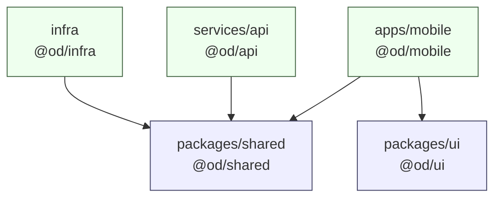

# Repository structure

**Status:** canonical for where code lives, what may depend on what, and how the workspace
is wired. The high-level layout and the package roles are set by
[`../02-architecture/tech-stack.md`](../02-architecture/tech-stack.md) §1, §3 and §4; this
document is the detailed expansion of it and the enforcement mechanism. Where the two
disagree, `tech-stack.md` wins and the conflict must be raised.

---

## 1. The tree

Annotated to the second or third level inside each package. A directory not listed here
does not exist yet; adding one is a decision, not a reflex.

```
ordinarydays/
├─ apps/
│  └─ mobile/                    @od/mobile — Expo app. iOS via EAS, web via static export.
│     ├─ app/                    Expo Router file tree. Routes only. See tech-stack.md §3.1.
│     │  ├─ _layout.tsx          Providers: Query, auth, theme, gesture root, safe area.
│     │  ├─ +not-found.tsx
│     │  ├─ (auth)/              sign-in, sign-up, verify
│     │  ├─ (app)/               Auth-guarded. (tabs)/, activity/, list/, people/,
│     │  │                       compose*, settings/
│     │  └─ invite/[token].tsx   Public invite page. Web-only surface.
│     ├─ src/
│     │  ├─ components/          Cross-feature composites that are not design primitives.
│     │  ├─ features/            Vertical slices. One directory per domain.
│     │  │  ├─ agenda/
│     │  │  │  ├─ components/    AgendaSection.tsx, AgendaRow.tsx, UpNextCard.tsx
│     │  │  │  ├─ hooks/         useAgenda.ts, useCompleteActivity.ts
│     │  │  │  └─ model/         partition.ts, applyCompletion.ts — pure, unit-tested
│     │  │  ├─ activities/  lists/  people/  expenses/  capture/  notifications/
│     │  ├─ hooks/               Cross-feature: useSession, useTimezone, useBreakpoint
│     │  ├─ lib/                 queryClient.ts, apiClient.ts, storage.ts, clock.ts
│     │  │  ├─ sqlite/           Native-only account DB lifecycle, migrations, typed
│     │  │                       repositories, transaction coordinator, outbox and sync.
│     │  │  └─ sync/             Typed native Activity push/pull and targeted-reconciliation
│     │  │                       adapters over `@od/shared/client`; no projection callbacks.
│     │  └─ stores/              Zustand stores, one file per UI domain
│     ├─ e2e/                    Maestro flows (.yaml) — iOS E2E
│     ├─ assets/                 Icons, splash, fonts. Nothing generated.
│     ├─ app.config.ts           Expo config, profile-driven (infrastructure.md §6.4)
│     ├─ eas.json  metro.config.js  babel.config.js  tsconfig.json  package.json
│     ├─ expo-env.d.ts           Generated by Expo; committed so CI typechecks without it
│
├─ services/
│  └─ api/                       @od/api — the single Lambda.
│     ├─ src/
│     │  ├─ index.ts             handler = handle(app). The deployed entry point.
│     │  ├─ local.ts             Node server for local dev. Never bundled.
│     │  ├─ app.ts               Hono instance, middleware chain, route mounting.
│     │  ├─ middleware/          requestId, logger, errorHandler, cors, securityHeaders,
│     │  │                       bodyLimit, routeSplit, identity, rateLimit, idempotency
│     │  │  └─ routeRegistry.ts  Every route + whether it needs an identity. Data and
│     │  │                       types only, imports nothing. Adding a route adds a
│     │  │                       line here, in the same PR (P1-30).
│     │  ├─ routes/              One file per resource. Mirrors api-contract.md §2.
│     │  │  ├─ me.ts  agenda.ts  activities.ts  participants.ts  attachments.ts
│     │  │  ├─ lists.ts  people.ts  expenses.ts  notifications.ts  capture.ts
│     │  │  └─ public/invites.ts
│     │  ├─ handlers/            validated input → service call → { data, meta } envelope
│     │  ├─ services/            Business rules, authz, orchestration, transactions.
│     │  │  └─ authz.ts          assertActivityAccess() — the single access check
│     │  ├─ repositories/        DynamoDB. The ONLY place pk/sk strings are built.
│     │  │  ├─ keys.ts           Key builders. Every pk/sk template in the product.
│     │  │  ├─ activityRepository.ts  listRepository.ts  personRepository.ts
│     │  │  └─ expenseRepository.ts   inviteRepository.ts  idempotencyRepository.ts
│     │  ├─ reminder/            The reminder Lambda's entry point + its handler.
│     │  └─ lib/                 ddb.ts, logger.ts, errors.ts, config.ts, secrets.ts,
│     │                          cursor.ts, clock.ts
│     ├─ scripts/                create-local-table.ts, seed-local.ts
│     ├─ test/                   Integration tests + DynamoDB Local harness
│     └─ tsconfig.json  package.json  vitest.config.ts
│
├─ packages/
│  ├─ shared/                    @od/shared — isomorphic domain core. No React, no AWS.
│  │  ├─ src/
│  │  │  ├─ index.ts             Re-exports the public surface of each subpath.
│  │  │  ├─ types/               Activity, Recurrence, List, Person, Expense, Agenda…
│  │  │  ├─ schemas/             Zod. One file per resource + common.ts primitives.
│  │  │  ├─ recurrence/          expand.ts, describe.ts — pure, ~100% covered
│  │  │  ├─ money/               split.ts, balance.ts, cents.ts — pure, ~100% covered
│  │  │  ├─ rank/                lexoRank.ts — fractional index for list ordering
│  │  │  ├─ time/                wallClock.ts, zone.ts, clock.ts (the Clock interface)
│  │  │  ├─ ids/                 generate.ts — prefixed ULIDs
│  │  │  ├─ client/              http.ts + endpoints/*.ts — typed API client
│  │  │  ├─ table/               definition.ts — key schema as plain data (see §3)
│  │  │  ├─ errors.ts            The closed ErrorCode union + AppErrorBody
│  │  │  ├─ constants.ts         MAX_PARTICIPANTS, MAX_AGENDA_DAYS, MAX_UPLOAD_BYTES…
│  │  │  └─ openapi.ts           zod-to-openapi registration
│  │  └─ tsconfig.json  package.json  vitest.config.ts
│  │
│  └─ ui/                        @od/ui — design primitives. RN + RNW. Knows no domain.
│     ├─ src/
│     │  ├─ theme/               tokens.ts, colors.ts, breakpoints.ts, ThemeProvider.tsx
│     │  ├─ primitives/          Text, Button, IconButton, Row, Card, Sheet, Field,
│     │  │                       Checkbox, Avatar, AvatarStack, Chip, SectionHeader,
│     │  │                       EmptyState, Toast, Skeleton, DatePicker, TimePicker
│     │  ├─ icons/               One component per icon. No icon font.
│     │  └─ index.ts             The single barrel. See §6.
│     └─ tsconfig.json  package.json
│
├─ infra/                        @od/infra — AWS CDK v2 app. See infrastructure.md §1.
│  ├─ bin/ordinarydays.ts
│  ├─ lib/config.ts  lib/stacks/*.ts  lib/constructs/*.ts
│  ├─ observability/queries/*.txt   Log Insights queries, one per investigation (P0-17)
│  ├─ scripts/migrations/NNNN-description.ts     One-off, idempotent, reviewed
│  ├─ scripts/seed-dev.ts
│  ├─ test/                      CDK assertion tests
│  └─ cdk.json  tsconfig.json  package.json
│
├─ docs/
│  ├─ 01-product/  02-architecture/  03-implementation/  04-conventions/  05-operations/
│  └─ generated/openapi.json     Generated AND checked in. CI fails if stale.
│
├─ e2e/                          Playwright specs for the web build (see testing.md §6)
│  ├─ specs/*.spec.ts  fixtures/  playwright.config.ts
│
├─ .github/
│  ├─ workflows/                 ci.yml, deploy-dev.yml, deploy-prod.yml, mobile.yml,
│  │                             nightly.yml
│  ├─ dependabot.yml
│  ├─ pull_request_template.md
│  └─ CODEOWNERS
│
├─ scripts/                      Repo-level node scripts: smoke.mjs, check-bundle-size.mjs
├─ docker-compose.yml            DynamoDB Local + dynamodb-admin + MinIO (local S3, Phase 3)
├─ pnpm-workspace.yaml  turbo.json  biome.json  lefthook.yml
├─ .dependency-cruiser.cjs  .npmrc  .nvmrc  .gitignore  .env.example
└─ package.json                  Root scripts only. No runtime dependencies.
```

---

## 2. What belongs in each package — and what must never

The "never" column is the part that matters. Each entry is enforced by a
`dependency-cruiser` rule (§4), a Biome rule, or a CI grep, and each is an automatic PR
rejection.

### 2.1 `packages/shared`

| Belongs | Never |
| --- | --- |
| Domain types (`types/`) | Any `react` or `react-native` import |
| Zod schemas — the single definition of every request and response shape | Any `@aws-sdk/*` import, including types |
| Pure domain logic: recurrence expansion, money splitting, lexo ranks, wall-clock maths | DynamoDB `pk`/`sk` construction |
| The typed API client and its `fetch` wrapper | `process.env` reads (config is injected) |
| Shared constants and the closed `ErrorCode` union | `new Date()` inside pure logic — a `Clock` is injected (see `coding-standards.md` §5) |
| The table key **description** (`table/definition.ts`) as plain data | Node built-ins other than `node:crypto` behind a platform shim |
| The OpenAPI registration | Anything that logs |

`packages/shared` is imported by everything and imports nothing from the workspace. If a
change to `shared` cannot be made without importing from another workspace package, the
code belongs somewhere else.

### 2.2 `packages/ui`

| Belongs | Never |
| --- | --- |
| Design tokens and the theme provider | Knowledge of `Activity`, `List`, `Person`, or any domain type |
| Presentational primitives with no domain vocabulary | `@tanstack/react-query`, `zustand`, or any data fetching |
| Platform-forked primitives (`DatePicker.web.tsx`) | Imports from `@od/shared` other than nothing — `ui` depends on **no** workspace package |
| Layout, spacing, colour, motion | Navigation (`expo-router`) — a primitive never navigates |
| Accessibility plumbing on primitives | Hard-coded colours, spacing values, or font sizes (`design-system.md` §9) |

> **Decision:** `packages/ui` depends on **zero** workspace packages, not even `@od/shared`.
> A design primitive that needs a domain type is not a primitive; it is a feature component
> and belongs in `apps/mobile/src/features/<f>/components/`. This keeps `ui` extractable and
> makes the dependency graph a tree rather than a diamond.

### 2.3 `apps/mobile`

| Belongs | Never |
| --- | --- |
| Routes (`app/`), feature slices, hooks, stores, client-side glue | `fetch` outside `@od/shared/client` |
| Web query keys, optimistic-update projections and invalidation policy | Business rules that the server also enforces — duplicate a rule and the two will drift |
| Native domain-specific SQLite repositories, transaction coordinators and outbox under `src/lib/sqlite/`; typed endpoint/reconciliation adapters under `src/lib/sync/` | A generic entity/base-view JSON store, ORM, CRDT, change feed, DynamoDB key mirror, or SQLite dependency on web |
| Platform forks (`.ios.tsx` / `.web.tsx`) where the platforms genuinely differ | `@aws-sdk/*` — the client never talks to AWS directly; it talks to the API |
| Screen-level composition under ~150 lines per route file | Recurrence expansion or money splitting reimplemented locally — import it from `@od/shared` |
| Maestro flows in `e2e/` | Inline styles inside list rows (`coding-standards.md` §9.5) |

### 2.4 `services/api`

| Belongs | Never |
| --- | --- |
| Hono routes, handlers, services, repositories, middleware | Business logic in a route handler — routes wire, handlers map, services decide |
| DynamoDB access **only** inside `repositories/` | A `DynamoDBDocumentClient` call outside `repositories/` |
| Key construction **only** inside `repositories/keys.ts` | A `pk`/`sk` template literal anywhere else |
| Transaction composition in `services/` | `Scan` — banned in application code (`data-model.md` §5), denied by IAM, grepped in CI |
| HTTP concerns confined to `routes/`, `handlers/`, `middleware/` | HTTP status codes, headers, or Hono types inside `services/` or `repositories/` |
| Env parsing in `lib/config.ts`, validated with Zod at module load | `process.env` reads outside `lib/config.ts` |
| Pure logic imported from `@od/shared` | Pure domain logic redefined locally |

### 2.5 `infra`

| Belongs | Never |
| --- | --- |
| CDK stacks, constructs, config, CDK assertion tests | Application runtime code — the Lambda's source lives in `services/api` |
| One-off migration and seed scripts under `scripts/` | Secrets, ARNs of secrets, or any credential |
| The only permitted `Scan`, inside `scripts/migrations/` | Importing from `@od/mobile`, `@od/ui`, or `@od/api` |
| Imports of `@od/shared/table` and `@od/shared/constants` for the key schema | Console-clicked resources — a change not in `infra/` did not happen |

### 2.6 `docs` and `.github`

`docs/` is prose plus exactly one generated artefact, `docs/generated/openapi.json`, which
is checked in (`api-contract.md` §6). No other generated file is committed.

`.github/` holds the five workflows in `infrastructure.md` §7, the PR template referenced by
`git-workflow.md` §3, `dependabot.yml`, and `CODEOWNERS`. Workflow logic beyond a few lines
goes in `scripts/*.mjs` so it can be run locally.

---

## 3. Dependency direction



Rules, in force order:

1. `packages/shared` imports **no** workspace package.
2. `packages/ui` imports **no** workspace package.
3. `apps/mobile` may import `@od/shared` and `@od/ui`.
4. `services/api` may import `@od/shared` only.
5. `infra` may import `@od/shared` only, and only the `table` and `constants` subpaths.
6. Nothing imports `apps/mobile`, `services/api`, or `infra`.
7. No cycles, at any granularity — package, directory, or file.

`packages/shared/src/table/definition.ts` exists so that `DataStack` and the local
table-creation script cannot drift (`infrastructure.md` §6.1). It exports **plain data**:

```ts
// packages/shared/src/table/definition.ts
export const TABLE = {
  partitionKey: 'pk',
  sortKey: 'sk',
  ttlAttribute: 'ttl',
  indexes: [
    {
      name: 'GSI1',
      partitionKey: 'gsi1pk',
      sortKey: 'gsi1sk',
      // INCLUDE, never ALL — aws-services.md §1.4 and data-model.md §3.5.
      projection: 'INCLUDE',
      nonKeyAttributes: [/* the AgendaItem fields, and nothing else */],
    },
  ],
} as const;
```

No `aws-cdk-lib` type, no `@aws-sdk` type. `infra` maps it onto CDK constructs; the API's
local script maps it onto a `CreateTableCommand`. Two consumers, one definition.

### 3.1 Layer direction inside `services/api`

```
routes/ → handlers/ → services/ → repositories/ → lib/ddb.ts
```

Each arrow is one-way. `repositories/` never imports from `services/`; `services/` never
imports from `handlers/`; nothing imports from `routes/`. `lib/` may be imported by any
layer but imports none of them.

### 3.2 Layer direction inside `apps/mobile`

```
app/ (routes) → src/features/*/components/ → src/features/*/hooks/
                                           ↘ src/features/*/model/ (pure)

web hooks    → TanStack adapter → @od/shared/client
native hooks → SQLite coordinator → serialized transaction
                                  ├→ typed repositories → domain-specific SQLite tables
                                  └→ transactional outbox
             → serialized SQLite sync engine → typed src/lib/sync adapters → @od/shared/client
                                      ↘ canonical repository transaction
```

`src/features/a/**` may not import `src/features/b/**`. If two features need the same
thing, it moves up to `src/components/`, `src/hooks/`, or `@od/ui`.

After an ADR-057 native cutover, hooks subscribe to typed repositories and never combine a
TanStack response with outbox intents at read/render time. A local coordinator appends the
intent and materializes visible rows in one serialized transaction; repository
subscriptions publish only after commit. The one native sync adapter owns network writes,
installs permitted canonical responses and settles the matching outbox receipt in a second
transaction. Connectivity merely schedules that adapter.
Native startup never registers the legacy intent-log/MutationCache replay session. The old
AsyncStorage sources are migration inputs only and are retired after SQLite receipts commit;
web TanStack persistence and optimistic adapters remain separate and unchanged.

This SQLite application model is deliberately separate from the server persistence model.
`services/api/src/repositories/` alone knows DynamoDB `pk`/`sk`/GSI shapes; native tables use
domain/query columns for Activity, occurrence, Agenda, reminder and outbox behavior and must
never copy those server keys.

---

## 4. How the rules are enforced

> **Decision:** enforcement is `dependency-cruiser`, not Biome or ESLint import rules.
> Biome's `noRestrictedImports` matches import specifiers, which is enough to ban
> `@aws-sdk/*` inside `packages/shared` but cannot express "files under
> `services/api/src/services/` may not reach `lib/ddb.ts` transitively", cannot detect
> cycles across packages, and cannot enforce reachability. `dependency-cruiser` does all
> three from one config, runs in about two seconds on this tree, and emits a graph for the
> docs. Biome still runs — it owns formatting, unused code, and specifier-level bans — but
> the architectural rules live in one file.

`.dependency-cruiser.cjs`, abbreviated to the rules that matter:

```js
module.exports = {
  forbidden: [
    { name: 'no-circular', severity: 'error', from: {}, to: { circular: true } },

    { name: 'shared-is-a-leaf', severity: 'error',
      from: { path: '^packages/shared/' },
      to:   { path: '^(packages/ui|apps|services|infra)/' } },

    { name: 'ui-is-a-leaf', severity: 'error',
      from: { path: '^packages/ui/' },
      to:   { path: '^(packages/shared|apps|services|infra)/' } },

    { name: 'no-aws-sdk-in-shared-or-ui', severity: 'error',
      from: { path: '^packages/(shared|ui)/' },
      to:   { path: 'node_modules/(@aws-sdk|aws-cdk-lib|aws-jwt-verify)' } },

    { name: 'no-react-in-shared', severity: 'error',
      from: { path: '^packages/shared/' },
      to:   { path: 'node_modules/(react|react-native|react-native-web)' } },

    { name: 'no-server-code-in-client', severity: 'error',
      from: { path: '^apps/mobile/' },
      to:   { path: '^(services|infra)/' } },

    { name: 'ddb-only-in-repositories', severity: 'error',
      from: { path: '^services/api/src/(routes|handlers|services|middleware)/' },
      to:   { path: '^services/api/src/lib/ddb\\.ts$' } },

    { name: 'no-sdk-outside-repositories-and-lib', severity: 'error',
      from: { path: '^services/api/src/(routes|handlers|services)/' },
      to:   { path: 'node_modules/@aws-sdk/' } },

    { name: 'no-hono-in-services', severity: 'error',
      from: { path: '^services/api/src/(services|repositories)/' },
      to:   { path: 'node_modules/hono' } },

    { name: 'layers-are-one-way', severity: 'error',
      from: { path: '^services/api/src/repositories/' },
      to:   { path: '^services/api/src/(services|handlers|routes)/' } },

    { name: 'no-cross-feature-imports', severity: 'error',
      from: { path: '^apps/mobile/src/features/([^/]+)/' },
      to:   { path: '^apps/mobile/src/features/(?!$1)([^/]+)/' } },

    { name: 'no-orphans', severity: 'warn',
      from: { orphan: true, pathNot: '\\.(d\\.ts|config\\.(ts|js|cjs))$' }, to: {} },
  ],
  options: {
    tsConfig: { fileName: 'tsconfig.json' },
    tsPreCompilationDeps: true,
    doNotFollow: { path: 'node_modules' },
  },
};
```

> **Amended in P0-27, in four places. Each was found by watching a rule fail to fire, and
> none of them should be "corrected" back to the snippet above.**
>
> **1. It parses through `tsc`, and that is why the compiler pin exists.** dependency-cruiser
> needs the TypeScript compiler's JavaScript API. Under the 7.x native compiler it has none:
> it prints `missing-typescript-transpiler` and then **exits 0 having cruised 3 modules and 0
> dependencies** — a green check that inspected nothing. P0-27 worked around that with
> `@swc/core`, whose parser cannot read `.tsx` at all, which blinded
> `no-cross-feature-imports` and `no-server-code-in-client` to every component file. That
> workaround is gone: `tech-stack.md` §2.1 pins the repository to `typescript@5.9.3`, largely
> on the strength of this rule set, and `.tsx` is cruised normally again.
>
> `scripts/check-forbidden.mjs`'s `client-layer-rules` is kept even so, as a second net. It
> is strictly weaker — it matched an aliased cross-feature import but **missed the same
> violation written as a relative path**, which is what a resolved module graph is for — but
> it costs nothing and it runs where the graph does not, on files excluded from the cruise.
>
> **2. `not-to-unresolvable` is added, and it is the rule that makes the module bans work.**
> Under pnpm's strict linking a forbidden dependency is usually *unresolvable* rather than
> resolved-to-a-banned-path: `packages/shared` importing `@aws-sdk/client-dynamodb` cannot
> resolve it, because `shared` does not declare it. dependency-cruiser then reports nothing,
> and `no-aws-sdk-in-shared-or-ui` never matches, because there is no resolved path to match.
> Verified by writing that exact file and watching the suite pass. The `to.path` patterns
> also gained a `(^|node_modules/)` prefix so they match the bare specifier too.
>
> **3. `ddb-only-in-repositories` takes `from: { pathNot: '…/repositories/' }`**, not a list
> of the four calling directories. The snippet's version catches only a *direct* import, so a
> handler that imports a `lib/` module that imports `ddb.ts` passes — verified. `reachable:
> true` cannot fix it either, because the legitimate architecture *is* routes → handlers →
> services → repositories → `ddb.ts`, and reachability would flag every correct route;
> `via`/`viaOnly` apply to circular rules only. Naming everything outside the repository layer
> as `from` closes the laundering path at its own edge. `no-sdk-outside-repositories-and-lib`
> is inverted the same way.
>
> **4. Resolution needs `enhancedResolveOptions` and its own tsconfig.** Without
> `exportsFields`/`conditionNames`, every subpath export — `hono/factory`, `@od/shared/schemas`
> — is reported unresolvable. And `tsconfig.depcruise.json` exists because dependency-cruiser
> takes one tsconfig for the whole cruise while the root one is a solution file with no
> `paths`, so `@/lib/apiClient` came out unresolvable too.

Alongside it, four cheap checks in `ci.yml`. The first three land with the dependency-cruiser
config in Phase 0 (P0-27); the fourth arrives with the identity seam in Phase 1 (P1-01).

> **Amended in P0-27: they are `scripts/check-forbidden.mjs <rule>`, not `grep` pipelines.**
> This repository is developed on Windows, where `grep` is not on the path outside Git Bash,
> so the commands below fail locally and pass in CI — the worst possible split. A `! grep …`
> negation also reports only that *something* matched, while the script prints the file, the
> line number and the line. The patterns and the intent are unchanged, and the fourth check
> still arrives in P1-01.

| Check | Command | Catches |
| --- | --- | --- |
| No `Scan` in app code | `! grep -rn "ScanCommand\|\.scan(" services/api/src apps packages` | `data-model.md` §5 |
| No raw key literals outside the repo layer | `! grep -rnE "'(ACT\|USER\|LIST\|INVITE\|EMAIL\|IDEM)#" --include=*.ts services/api/src --exclude-dir=repositories` | §2.4 |
| No `dangerouslySetInnerHTML` | `! grep -rn "dangerouslySetInnerHTML" apps packages` | `security-privacy.md` §1 row 6 |
| `AUTH_MODE` confined to two files | `! grep -rn "AUTH_MODE" services/api/src apps packages --include=*.ts --exclude=config.ts --exclude=identity.ts` | The identity seam (`infrastructure.md` §6.2) |

Each runs as its own step so the failure message names the rule that was broken.

---

## 5. Workspace configuration

### 5.1 `pnpm-workspace.yaml`

```yaml
packages:
  - "apps/*"
  - "services/*"
  - "packages/*"
  - "infra"

onlyBuiltDependencies:
  - esbuild
  - "@biomejs/biome"
  - lefthook
```

`onlyBuiltDependencies` is the supply-chain control from `security-privacy.md` §7: install
scripts run only for packages listed here, and adding one is a reviewed change.

`.npmrc`:

```
save-exact=true
strict-peer-dependencies=false
auto-install-peers=true
```

`strict-peer-dependencies=false` is required because the Expo SDK's peer graph is not
internally consistent across every RN package; `npx expo-doctor` in CI is the check that
actually matters there (`tech-stack.md` §6).

### 5.2 `turbo.json`

Expanded from `tech-stack.md` §1. `dependsOn: ["^build"]` is what makes `shared` build
before its consumers.

```json
{
  "$schema": "https://turbo.build/schema.json",
  "globalDependencies": ["tsconfig.base.json", ".nvmrc", "biome.json"],
  "tasks": {
    "build": {
      "dependsOn": ["^build"],
      "outputs": ["dist/**", ".expo/**", "cdk.out/**"]
    },
    "typecheck":   { "dependsOn": ["^build"], "outputs": [] },
    "test":        { "dependsOn": ["^build"], "outputs": ["coverage/**"] },
    "test:int":    { "dependsOn": ["^build"], "cache": false },
    "lint":        { "outputs": [] },
    "gen:openapi": {
      "dependsOn": ["^build"],
      "outputs": ["../../docs/generated/openapi.json"]
    },
    "dev":         { "cache": false, "persistent": true },
    "e2e":         { "dependsOn": ["build"], "cache": false }
  }
}
```

`test:int` and `e2e` are uncached: they depend on Docker and on a deployed environment,
neither of which Turbo can hash.

### 5.3 TypeScript project references

One base config, one solution config, one config per package. Project references give `tsc`
incremental builds and give the editor correct go-to-definition into `@od/shared` source.

```jsonc
// tsconfig.base.json — the only place compiler options are set
{
  "compilerOptions": {
    "target": "ES2022",
    "lib": ["ES2023", "DOM"],
    "module": "ESNext",
    "moduleResolution": "Bundler",
    "strict": true,
    "noUncheckedIndexedAccess": true,
    "noImplicitOverride": true,
    "noFallthroughCasesInSwitch": true,
    "exactOptionalPropertyTypes": true,
    "verbatimModuleSyntax": true,
    "isolatedModules": true,
    "skipLibCheck": true,
    "composite": true,
    "declaration": true,
    "declarationMap": true,
    "sourceMap": true,
    "jsx": "react-jsx"
  }
}
```

```jsonc
// tsconfig.json — solution file. Contains no files of its own.
{
  "files": [],
  "references": [
    { "path": "packages/shared" },
    { "path": "packages/ui" },
    { "path": "apps/mobile" },
    { "path": "services/api" },
    { "path": "infra" }
  ]
}
```

```jsonc
// services/api/tsconfig.json
{
  "extends": "../../tsconfig.base.json",
  "compilerOptions": { "outDir": "dist", "rootDir": "src", "types": ["node"] },
  "include": ["src/**/*", "test/**/*", "scripts/**/*"],
  "references": [{ "path": "../../packages/shared" }]
}
```

### 5.4 Path aliases

Two kinds, and they work differently. Getting this wrong produces a build that typechecks
and then fails in Metro.

| Alias | Scope | Resolved by |
| --- | --- | --- |
| `@od/shared`, `@od/shared/money`, `@od/ui` | Cross-package | **pnpm workspace links**, not tsconfig paths. `package.json` `exports` subpaths (`tech-stack.md` §3.3) do the routing. Metro, esbuild and `tsc` all understand them. |
| `@/…` | Inside `apps/mobile` only | tsconfig `paths` + `babel-plugin-module-resolver`, both pointing at `apps/mobile/src`. |

```jsonc
// apps/mobile/tsconfig.json
{
  "extends": "../../tsconfig.base.json",
  "compilerOptions": { "paths": { "@/*": ["./src/*"] } },
  "references": [
    { "path": "../../packages/shared" },
    { "path": "../../packages/ui" }
  ]
}
```

Do **not** add tsconfig `paths` entries for `@od/*`. They would let `tsc` resolve an import
that Metro cannot, which is the exact failure mode the workspace links exist to prevent.

---

## 6. Barrel-file policy

| Location | Barrel? |
| --- | --- |
| `packages/shared/src/<subpath>/index.ts` | **Yes** — one per declared `exports` subpath, and only those. |
| `packages/ui/src/index.ts` | **Yes** — one, the package's public surface. |
| `apps/mobile/src/features/*/` | **No.** Import the file directly. |
| `services/api/src/**` | **No.** |
| `infra/**` | **No.** |

Barrels inside an application create import cycles that are invisible until a module
initialises in the wrong order, and they defeat Metro's and esbuild's ability to drop unused
code. The two package-level barrels are worth their cost because they are the contract
between packages.

---

## 7. Where does this file go?

The lookup table. If the thing you are adding is not in this table, add a row in the same
PR.

| I am adding… | Files to touch, in order |
| --- | --- |
| **A new API route** | 1. `packages/shared/src/schemas/<resource>.ts` (request + response schema)<br>2. `packages/shared/src/client/endpoints/<resource>.ts`<br>3. `services/api/src/routes/<resource>.ts` (route + `zValidator`)<br>4. `services/api/src/handlers/<resource>.ts`<br>5. `services/api/src/services/<resource>Service.ts`<br>6. `services/api/src/repositories/<resource>Repository.ts` if new access<br>7. `services/api/test/routes/<resource>.test.ts`<br>8. `pnpm run gen:openapi`<br>9. `docs/02-architecture/api-contract.md` §2 row |
| **A new Zod schema** | `packages/shared/src/schemas/<resource>.ts`. Primitives (`isoDate`, `hhmm`, `cents`, `ulidId`) go in `schemas/common.ts` and are reused, never re-declared. Export the inferred type from the same file. |
| **A new screen** | 1. `apps/mobile/app/(app)/<route>.tsx` (route file, thin)<br>2. `apps/mobile/src/features/<f>/components/<Screen>.tsx`<br>3. `apps/mobile/src/features/<f>/hooks/use<Thing>.ts`<br>4. `apps/mobile/src/features/<f>/model/*.ts` for any pure logic<br>5. Component test beside the component |
| **A new shared UI primitive** | 1. `packages/ui/src/primitives/<Name>.tsx`<br>2. Export from `packages/ui/src/index.ts`<br>3. Row in `docs/04-conventions/design-system.md` §5<br>4. Test in `packages/ui/src/primitives/<Name>.test.tsx` |
| **A new CDK construct** | `infra/lib/constructs/<kebab-name>.ts`, used by a stack in `infra/lib/stacks/`. Assertion test in `infra/test/<kebab-name>.test.ts`. Never instantiate an L1/L2 resource directly in a stack when a construct already wraps it. |
| **A unit test** | Beside the source: `src/foo.ts` → `src/foo.test.ts`. |
| **An integration test** | `services/api/test/integration/<subject>.int.test.ts`. |
| **An E2E test** | Web: `e2e/specs/<flow>.spec.ts`. iOS: `apps/mobile/e2e/<flow>.yaml`. |
| **A migration script** | `infra/scripts/migrations/NNNN-description.ts`, four-digit sequential. Idempotent, `--dry-run` default true, `--stage` required. |
| **A repository method** | `services/api/src/repositories/<x>Repository.ts` + a row in `data-model.md` §5 if it is a new access pattern. A new access pattern without that row is rejected. |
| **A new limit or magic number** | `packages/shared/src/constants.ts`. Never a literal on two sides of the wire. |
| **A new error code** | `packages/shared/src/errors.ts` (the closed union) + a row in `tech-stack.md` §4.4 + a row in `interaction-contract.md` §5.3 for its user-facing copy. |
| **A new query key** | `apps/mobile/src/features/<f>/hooks/keys.ts`. Query keys are never inline strings. |
| **A new environment variable** | `services/api/src/lib/config.ts` (Zod), `.env.example`, the Lambda `environment` in `infra/lib/stacks/api-stack.ts`. Identifiers only — never a secret (`security-privacy.md` §6). |
| **A new npm dependency** | The owning workspace's `package.json` only, plus the justification block in the PR description (`security-privacy.md` §7). Never the root `package.json`. |

---

## 8. Naming conventions

### 8.1 Files and directories

| Kind | Convention | Example |
| --- | --- | --- |
| Directory | kebab-case | `src/features/expenses/`, `lib/constructs/` |
| React component file | PascalCase, one component per file, file named for it | `AgendaRow.tsx`, `AvatarStack.tsx` |
| Hook file | camelCase, `use` prefix | `useAgenda.ts` |
| Everything else in TS | camelCase | `activityRepository.ts`, `lexoRank.ts` |
| Expo Router route | Expo's own convention — lowercase, brackets, parens | `[id].tsx`, `(tabs)/index.tsx` |
| Platform fork | Base name + platform suffix | `storage.ios.ts`, `DatePicker.web.tsx` |
| Unit test | Subject + `.test.ts(x)`, beside the subject | `split.test.ts` |
| Integration test | Subject + `.int.test.ts`, under `test/integration/` | `activityRepository.int.test.ts` |
| Playwright spec | kebab-case + `.spec.ts` | `invite-rsvp.spec.ts` |
| Maestro flow | kebab-case + `.yaml` | `complete-task.yaml` |
| CDK stack file | kebab-case + `-stack.ts` | `observability-stack.ts` |
| Migration | `NNNN-kebab-description.ts` | `0003-backfill-gsi1-recurring.ts` |
| Doc | kebab-case + `.md` | `agent-playbook.md` |

### 8.2 Exports and identifiers

| Kind | Convention |
| --- | --- |
| Components | `PascalCase`, named export, no default export anywhere |
| Functions and hooks | `camelCase`; hooks start with `use` |
| Types and interfaces | `PascalCase`, no `I` prefix, no `T` prefix |
| Zod schemas | `camelCase` matching the type: `createActivityInput` → `CreateActivityInput` |
| Constants | `SCREAMING_SNAKE_CASE` for true constants; `camelCase` for frozen config objects |
| Enums | None. Use string literal unions (`coding-standards.md` §1.4) |
| Query keys | `camelCase` factory functions: `agendaKey(date)`, `activityKey(id)` |
| Repository methods | Verb-first, storage-neutral: `getActivity`, `listItemsForList`, `putOccurrence` |
| Service methods | Domain-first: `scheduleActivity`, `markExpenseObligationsSettled` |
| Test names | A sentence: `it('distributes remainder cents to the lowest personIds', …)` |

### 8.3 Branches

`<type>/<phase-task-id>-<slug>`, all lowercase except the task ID.

```
feat/P2-01-recurrence-engine
fix/P3-12-agenda-dst-boundary
chore/P1-04-biome-config
docs/P0-02-conventions
```

The full branching and commit rules are in
[`git-workflow.md`](git-workflow.md).

### 8.4 Package names

`@od/<dir>`: `@od/mobile`, `@od/api`, `@od/shared`, `@od/ui`, `@od/infra`. The scope is
`@od` everywhere; it is not published, so it never needs to be globally unique.

---

## 9. Root `package.json` scripts

The root has no runtime dependencies and no source. Its scripts are the entry points an
agent uses.

```json
{
  "scripts": {
    "dev": "turbo run dev --parallel",
    "build": "turbo run build",
    "typecheck": "turbo run typecheck",
    "test": "turbo run test",
    "test:int": "docker compose up -d && turbo run test:int",
    "lint": "biome check .",
    "lint:fix": "biome check --write .",
    "depcruise": "depcruise --config .dependency-cruiser.cjs apps packages services infra",
    "gen:openapi": "pnpm --filter @od/shared run gen:openapi",
    "e2e:web": "playwright test",
    "verify": "pnpm lint && pnpm typecheck && pnpm test && pnpm depcruise"
  }
}
```

`pnpm verify` is the command an agent runs before opening a PR. It is the same set of checks
`ci.yml` runs, minus the AWS-credentialled jobs.
